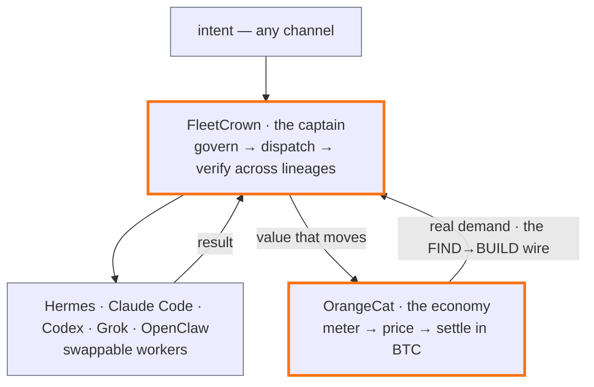

## The question that will not die

Every few weeks the same question returns in a new costume. Is the new agent the one that finally kills the last one. Is Hermes the OpenClaw killer. Is Codex the Claude Code killer. The question feels urgent and is very nearly content-free — and the fact that it stays askable, forever, about a rotating cast, is the most informative thing in the entire agent market. You do not ask which of two things is the killer unless they already occupy the same slot. The question is a quiet confession that the tools are converging toward the same shape.

Converging is not the same as identical, and it is worth being precise about which is true. These tools are not yet interchangeable — but the layer they sit on is commoditizing in front of us, and you can point at the evidence. The `SKILL.md` format now reads the same way across Claude Code, Codex, and Grok; a skill written for one is legible to the others. When the *unit of reusable expertise* becomes a shared file format, the thing above it has started to become a substrate. A layer commoditizes when its instances stop deciding anything — and a layer directly beneath you is exactly the one you want to reach that stage. FleetCrown made an early bet on which layer that would be. The churn everyone narrates as a war is that bet paying off. To see why, look closely at what a worker actually is now, and then at the two things it cannot become no matter how good it gets.

## What a worker is, in 2026

A worker is a single agent that loops on a task. Strip the branding off Claude Code, Codex, Cursor's agent, Grok, our own OpenClaw, and Nous Research's Hermes, and the same five parts sit underneath each of them:

- **A loop** that finds work, runs a step, observes the result, and decides the next move.
- **A verifier** — but read this one carefully, because it is the crux of everything below. The verifier here is the agent running *its own* tests, linter, and build, then reacting to the failures. It is self-checking, not an independent referee.
- **A skills store** the agent reads and, increasingly, rewrites — the `SKILL.md` files now portable between tools.
- **A memory** that survives the session, summarized and re-injected so intent compounds instead of resetting each morning.
- **An execution substrate that is not your laptop** — and this is the one where they still genuinely differ.

That last divergence is worth naming honestly. Codex was cloud-first — isolated containers, parallel tasks, opening pull requests — and added a local CLI. Claude Code went the other way, local-first, and added a hosted sandbox on the web. Grok, as of this writing, is local-only: xAI ships no first-party cloud execution, so an agent it runs still runs on your machine. So the substrate is converging, but from opposite ends, and not everyone has arrived. "Interchangeable workers" is where this is heading, not where it is.

Hermes rewards a close reading, because it is the most complete public instance of the shape — and because a parked adapter for it already sits on FleetCrown's own production box, at `/usr/local/bin/hermes`, unwired. Look at what it actually ships, as of `v0.19.0` (released days before this essay, on a roughly weekly cadence).

It runs on six execution backends — `local`, `docker`, `ssh`, `singularity`, `modal`, `daytona` — selected by one config line. The Docker backend is the interesting one: a single long-lived container, hardened with `--cap-drop ALL`, `--security-opt no-new-privileges`, `--pids-limit 256`, and a size-limited tmpfs, reused across every tool call and subagent for the life of the run. The container is not a convenience; it is the security model. Inside an isolated backend the agent stops asking permission for dangerous commands, *because the container itself is the boundary* — the blast radius is a box you drew on purpose. Two of those backends, Daytona and Modal, are serverless: the environment is snapshotted and hibernated when idle and restored on the next session. The scale-to-zero economics — waking in a few hundred milliseconds, billed by the active second — are properties of Daytona and Modal themselves, and they are exactly the "runs where the computation is, costs nearly nothing idle" property the earlier essay "The Captain Needs a Ship" called the keystone. It exists today as a backend flag rather than a system to build.

It is model-agnostic to the bone. Models are provider-prefixed strings — `anthropic/claude-opus-4`, `openrouter/...`, a self-hosted endpoint — switched with a single `hermes model` command and no code change. This is the detail that quietly ends the rivalry framing before it starts: the runtime and the model are independent choices. You can point the best sandbox at the best model and owe neither vendor your architecture.

The safety floor is explicit. A headless `hermes -z "<task>" --yolo` disables per-command checks for the session, all except a non-overridable *hardline blocklist* — `rm -rf /`, `mkfs` on a mounted root, `dd` to a raw disk, the classic fork bomb — that no flag, config, or cron mode can switch off. And the loop feeds itself: after a task with more than a handful of tool calls, a background review can summarize the trajectory into a Markdown skill, so the next run starts having read what the last one learned.

Now the part that matters for the question we opened with: Hermes is not only a coding runtime. It ships more than twenty messaging surfaces of its own — Telegram, Discord, Slack, WhatsApp, Signal, a CLI — plus cron and MCP. In other words, it is a worker *and* a gateway. And so is OpenClaw, from the other direction: our own gateway is not only a chat pipe, it executes shell, runs Python, spawns subagents. The two genuinely overlap. Which is why "is Hermes the OpenClaw killer" is not a category error to wave away — it is a fair question about two things in the same category. The honest answer is not that they are different kinds of thing. It is that they are the *same* kind of thing — a single worker that happens to carry its own front door — and that is precisely the layer that commoditizes.

Be exact about what none of this proves. Hermes is a `v0.x` product on a weekly cadence — it briefly shipped a seventh backend (a Vercel sandbox) and cut it a version later. Nearly every capability claim traces to Nous's own documentation, and its headline "neutral alignment" number, RefusalBench, is a benchmark Nous wrote and had a model judge — one hundred sixty-six prompts, scored by Claude Sonnet 4. No independent evaluation yet shows the Hermes runtime or its open-weight models — Hermes 3 on Llama-3.1, the hybrid-reasoning Hermes 4, or the 36B Hermes 4.3 on Seed-OSS with a half-million-token context that is small enough to self-host — matching Claude Code or Codex on real coding work. This is a hull worth having. It is not yet a hull anyone has proven seaworthy under load. Both are true at once, and adopting it means holding both.

## The two things a worker cannot be

Now give the worker all five layers, perfected, and its own gateways besides. Suppose the loop never stalls, the sandbox never escapes, the memory never forgets, the skills compound cleanly. Two things remain out of reach — not because the engineering is unfinished, but because of what a single mind is.

> A worker cannot verify itself. Its test-and-lint loop is self-checking: it catches what it thought to check, graded against the standard it already applied when it wrote the code.

A check that can actually *fail* the work has to come from somewhere the work did not — a different model lineage, a suite that goes red without the author in the room. This is not a plugin you install; it is a structural fact. A mind cannot be the independent judge of its own output, because independence is precisely the thing it lacks with respect to itself. The moment you want verification you can trust, you have stopped talking about one agent and started talking about at least two, plus a rule for when they disagree.

> A worker cannot price its own work. It has no counterparty and no ledger. It can produce value all night and have no idea what the value is, who needed it, or how anything moves once it is done.

Price is not a property of the work; it is a relation between the work and someone who wanted it, recorded somewhere both can see. A single agent generating output is a factory with no market bolted to its loading dock. Value requires a second party and a system of record, and a worker is definitionally one party with a scratchpad.

These two impossibilities are the entire argument. Verification-by-another and value-that-moves both demand something a single worker is without by definition: plurality, and a ledger. Name the first governance and the second economy. They are not features you add to an agent once it is good enough. They are the two things an agent, however good, cannot be.

## Our tools, specifically

FleetCrown is built on the first impossibility. It keeps two queues, and keeps them distinct. The `actions` table holds proposed effects on the operator's actual life — a calendar event, a message, a commitment — moving through `draft → approved → executed` under an iron rule stated in the schema itself: nothing in `draft` ever executes, there is no auto-approve, there is no bypass. Code dispatches to the workers ride a *separate* queue, `pending_commands`, claimed with `FOR UPDATE SKIP LOCKED` so two runners never grab the same row, and serialized per project so a fleet stays ordered without going single-file across projects. Two queues, one principle: nothing external happens without a decision.

Above the queues sits the thing a lone worker cannot host: a registry of workers. Claude, Grok, Cursor, Codex, OpenClaw, and Gemini are all just adapters in one list; Hermes is a parked entry waiting to join it. Every agent is a swappable ship, and the object that owns the list is none of them. When a dispatch runs, the project's own profile — its mission, stack, conventions, and bar for "done" — is injected into it, and the result is judged by a definition-of-done gate run through a *different* model lineage than the one that did the work: an `openai/gpt-oss-120b` judge grading a Claude-or-Llama worker's claim that it met the bar. That is the self-verification impossibility answered structurally — the judge is, by construction, not the author. The frontier digest goes further still: it reads the world each day and proposes how the system should change, and each proposal faces an adversarial panel of two more lineages where any single diverse judge can veto it, before a human ever sees it. Independence is not a vibe here; it is wired.

OpenClaw and Loki are how intent gets aboard. OpenClaw is FleetCrown's multi-channel gateway — Telegram today, more scaffolded — and it is itself just one more adapter in that same registry, which tells you what it is: a worker with a front door, exactly like Hermes. Loki is the assistant you reach across those channels. What matters is the discipline at the seam: nothing the assistant surfaces acts on the world directly. An external, irreversible effect becomes a `draft` in the `actions` queue and waits there for an explicit approval — the gate is the product, not the chat.

OrangeCat is built on the second impossibility — it is the ledger and the counterparty a worker does not have. It meters what the fleet does through a per-message ledger denominated in BTC, at a transparent markup over provider cost, and settles in Bitcoin. And it does the thing marketplaces almost never do: it remembers *need*, not only supply. A wish is written into the same vector space as the listings, and when a match crosses a threshold the system notifies *both* sides — the person who wanted it and the person who can now supply it. Its demand feed is, in its own code comment, "the FIND→BUILD wire": FleetCrown reads it so a builder can build against real, current demand and list the result straight back. The essay "Each Built the Other's Missing Half" traced how the two codebases turned out to hold complementary halves — FleetCrown has recurring pricing but no metering; OrangeCat meters and settles but, because Bitcoin has no native recurring primitive, has no recurring product of its own. Each had built, to completion, precisely the half the other was missing. Money is the anchor that keeps a capability layer honest.

Set against all that, Hermes stops being a competitor and becomes an obvious component. Revive the parked adapter, run it on the container backend against your own repositories, keep the model pointer aimed at whichever frontier model is best this week, and FleetCrown inherits the sandbox and the never-sleeping execution the captain essay named as its missing hull — without abandoning the models it already trusts, and without pretending the open-weight ones have been proven yet. That is still a plan and not a shipped, load-bearing runner. The honesty of the captain essay stands: until it ships, the fleet still borrows a laptop to run its code, and a borrowed ship is the largest thing between the product and its own thesis.

## Sovereignty is the deeper reason

There is a reason to prefer the open, model-agnostic, self-hostable hull that runs past engineering. A stack you can own end to end — open weights you can run, a runtime that owes no vendor your architecture, a box that is yours — is a stack no one can revoke, reprice, or align away from underneath you. The worker layer commoditizing is not only a market fact; it is a transfer of power downward, to whoever holds the layers above it. The captain and the port are those layers. Governance decides what the fleet does and proves it was done by a mind that is not the doer; the economy decides what the work was worth and moves it between two parties who agree. Both are things a single mind cannot be, which is exactly why they are the things worth owning.

The worker tools are asking which of them is the last one standing. FleetCrown is not in that fight.

> It commands whichever ship wins, and it owns the port they all sail to — and a fleet outlives its ships.
