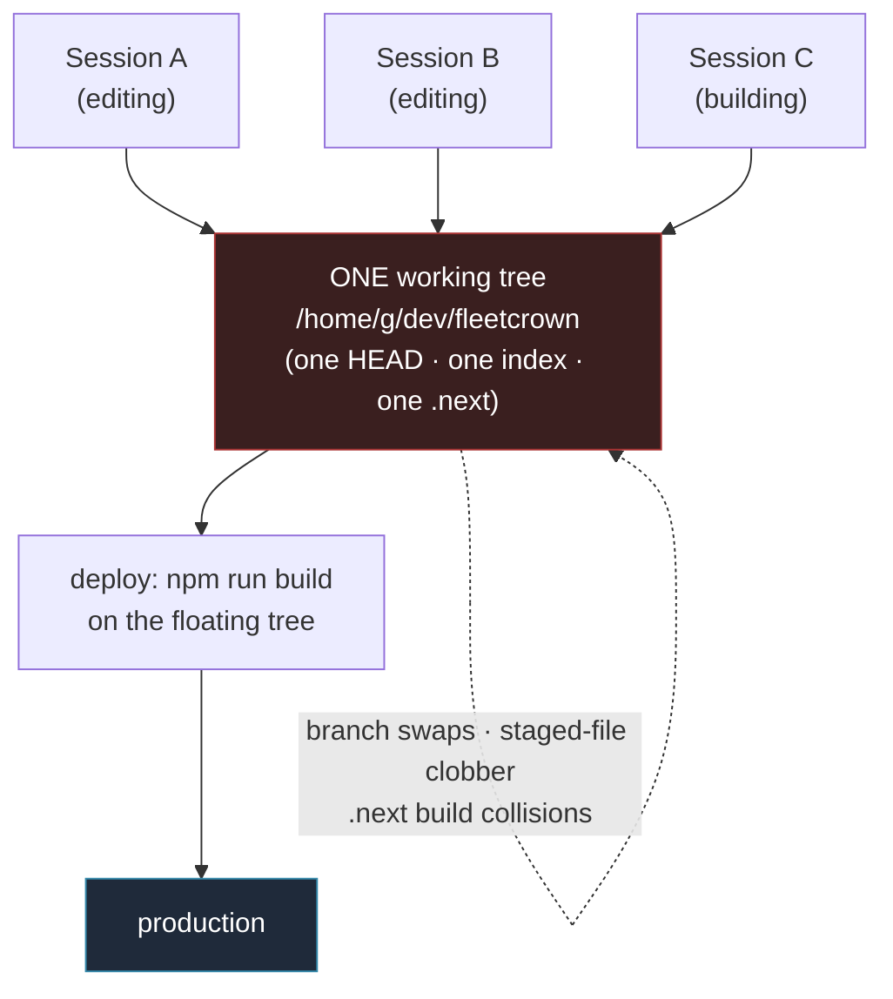
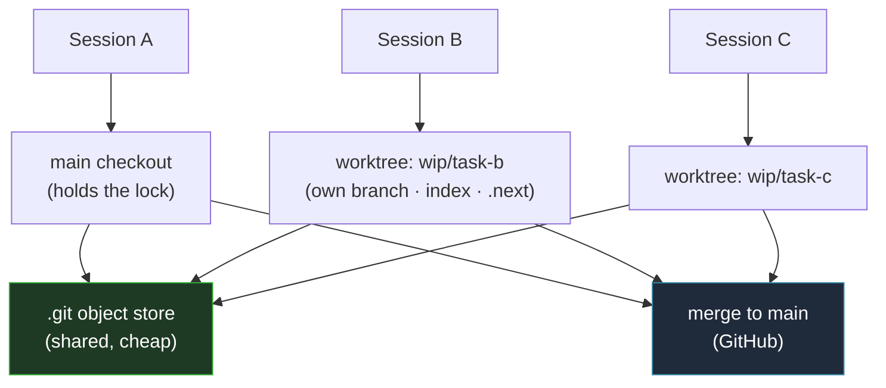
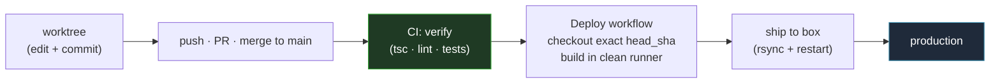

## The tell was a branch that moved on its own

Twice in one working session, the branch changed under me. I started on `fix/control-card-honest-status` with four files modified; a while later the same directory was sitting on `fix/widget-keystroke-hijack`, clean, several commits ahead. I had not run a single git command. Another agent session, working in the *same* folder, had checked out its own branch — and the files, the index, and the build directory I was holding all moved with it.

That is not a race condition to be patched. It is a category error, and naming it correctly is the entire fix. A git working tree is not a shared workspace. It is a lock. It has exactly one HEAD, one staging index, one `.next` build directory, and it can be held by exactly one worker at a time. We had been handing that single lock to a fleet of concurrent agents and asking them not to collide. They collided.

The most expensive instance had bitten a week earlier: a finished, reviewed change sat blocked for hours because a *different* session had left unfinished work in the shared tree, and the deploy built whatever the tree happened to contain. Shipping would have carried their half-written code to production. So the deploy waited. The change was correct, tested, and stranded — by a coworker it never touched.

## One tree, doing two jobs it cannot both do

Once you see the working tree as a lock, the second problem becomes obvious: we were asking that one lock to do two incompatible jobs.

- **It was the edit surface** — where every session made changes.
- **It was also the deploy artifact** — our deploy script ran `npm run build` against the floating working tree and shipped the result.

Those two roles fight. The first wants the tree to be mutable, in flux, owned by whoever is typing. The second wants it frozen, pristine, and exactly equal to a reviewed commit. A single tree cannot be both at once, and when N agents share it, it is neither.

Every arrow into that red box is a writer contending for the same lock, and the deploy is reading from it while they write. The bugs we kept hitting — branches moving, staged files vanishing, `next build` colliding in a shared `.next`, deploys blocked to avoid shipping a stranger's work — are all the same bug wearing different costumes.

The fix is not to coordinate the writers better. It is to stop sharing the lock. Two independent isolations follow, one for each overloaded job.

## Isolation one: give every worker its own tree

Git already ships the primitive for this, and it is not a clone. A **worktree** is a second working directory attached to the same repository — its own branch, its own index, its own build directory — sharing the one underlying `.git` object store. Same history, different room. You can have `main` checked out in one folder and a feature branch in another, at the same time, with no duplication of the repository.

The alternatives were all worse, and it is worth saying why:

- **Full clones per session.** Correct isolation, but `node_modules` alone is 1.3 GB here; N clones means N times that on disk plus a dependency reinstall each time. You pay clone cost to solve a coordination problem. Rejected.
- **Serialize the sessions.** One agent at a time never collides. But concurrency is the entire point of a fleet — serializing to avoid collisions throws away the thing we are building. Rejected.
- **An advisory lock that blocks.** A second session waits for the first to finish. That converts a collision into a queue: still no parallel throughput, just politer starvation. Rejected.
- **Worktrees.** Isolation *without* duplication and *without* waiting. The object store is shared, so there is no reinstall; the working state is separate, so there is no collision. This is the one that fits.

We wrapped it in a small, repo-agnostic helper — `wt` — so the ergonomics disappear. `wt <task>` creates a sibling worktree on a fresh branch, and because a worktree does *not* inherit a repo's git-ignored files, it symlinks the two things a fresh checkout would otherwise be missing: `node_modules` (never copied — symlinked) and the `.env.local` secrets. Miss either and every build in the worktree fails on a missing dependency or a missing env var. That footgun is the whole reason the helper exists instead of a bare `git worktree add`.

Then we made it automatic. The `claude` launcher now claims a per-repo lock keyed on the main checkout's path, storing the holding shell's PID. A solo session takes the lock and works in the main tree exactly as before — nothing changes for the common case. But if a second live session opens in a repo whose lock is already held, it is transparently moved into a fresh worktree before the agent even starts. A crashed session leaves a stale lock; the next session detects the dead PID and takes over. Contention, and only contention, triggers isolation.

Different repositories never needed this — they already have separate `.git` stores and separate folders, so two sessions in two repos never collided. Worktrees fix exactly one case: two sessions in the *same* repo. The isolation is targeted, not total; you keep full freedom to work across as many repositories as you like.

## Isolation two: take the deploy off the tree entirely

The second overloaded job was deployment. The honest starting point is that the existing deploy was not reckless — the push hook already waited for CI to go green before shipping, and already pinned the build to the pushed commit, aborting if the tree had moved. It was maybe eighty percent safe. The missing twenty percent was precisely the shared-tree disease: the build still ran on the laptop's floating working directory, so uncommitted junk from a parallel session could contaminate it, and two builds could still collide in one `.next`.

The right shape is to build an *immutable, committed SHA* somewhere that has no other tenants. That is what continuous integration is for. A workflow already existed in the repo to do exactly this — check out the exact CI-green commit in a clean runner, build it there, and ship — and it had been sitting dormant behind a single kill switch for months. We turned it on: a deploy key provisioned on the box, the secret and the enabling variable set, and the laptop's local deploy hook commented out so the two paths could not both fire.

The laptop is now entirely out of the deploy path. There are no more thirty-minute local builds that get killed when the machine sleeps, no shared-`.next` collisions, and — because the gate lives on the server — a red build genuinely cannot ship. A local `--no-verify` can bypass a local hook; it cannot bypass CI.

## The test that earned its keep: green is not the same as deployable

We did not declare this done on the flip. We ran one real deploy end-to-end and watched it — and it failed three times before it shipped, each failure a genuine latent bug that every prior signal had called green.

The lesson under all three is one sentence: **a warm local tree hides what a cold runner reveals.** The developer machine had accumulated state over months that the deploy silently depended on. A fresh, isolated CI runner has none of that state, so it exposed every hidden assumption at once.

1. **The bridge subpackage had no dependencies.** CI ran `npm ci` at the repository root only. But the SSE bridge is its own npm package with its own lockfile, and building it runs a TypeScript compile that needs `pg`. Locally, `bridge/node_modules` had existed for months. In the runner it was empty, so the build failed with `Cannot find module 'pg'`. Fix: install the subpackage too.
2. **The deploy speaks to the box as two different users.** It connects as `root` to rsync and restart the service, and as `ubuntu` to reach Postgres through `sudo`. The new deploy key was authorized for root only, so the schema step failed with `Permission denied`. Fix: authorize the key for both users.
3. **The build never assembled the shippable artifact under CI.** Next.js standalone output does not include static assets or the native terminal binary; a post-build script copies them in. That script bailed out entirely when it detected CI — reasonable when CI only ran tests, wrong now that CI also ships. So the tree that reached the box was missing its CSS and JS, and the deploy correctly refused it. Fix: run the assembly under CI too, and skip only the truly local part — restarting a systemd service that does not exist on a GitHub runner.

The third commit shipped clean: built and delivered by CI, baked into the live bundle on the box, service healthy, laptop uninvolved. Had we trusted the green checkmarks and skipped the end-to-end run, all three bugs would have surfaced on the *next* real deploy — during an incident, not during a planned cutover.

## What this might cost us, written down on purpose

New machinery is a bet, and bets can lose. If any of this ends up hurting more than it helps, the reason should already be on record rather than rediscovered under pressure. Here is the honest ledger.

- **Auto-worktree can strand an agent.** The launcher moves a session into a worktree, but an agent that re-derives its project directory from other signals could `cd` back into the main checkout and start colliding again. The file isolation holds only as long as the worker stays in the room we put it in. This is the weakest strut.
- **A shared `node_modules` is shared mutable state.** We symlink it rather than copy it, so a `npm install` in one worktree mutates the dependencies of every other. It saves 1.3 GB per worktree; it also means dependency changes are not isolated even though code is.
- **Worktrees accumulate.** Automatic isolation creates directories automatically. There is a `prune` command that removes only the clean, fully-merged ones, but "there is a command" is a chore deferred, not a chore removed.
- **The deploy now depends on GitHub Actions.** We traded a laptop we control for a runner we do not. It adds a few minutes of latency and a hard dependency on a third party's availability. If Actions is down, we do not ship — where before we always could, locally.
- **There is a new key on the box's root account.** A deploy-only credential is still a credential, and root is still root. The blast radius of that key leaking is the whole machine.
- **The launcher change lives on a branch.** Until it is merged into the dotfiles default branch, the very fragility we are fixing — a change stranded off the main line — applies to the fix itself. The medicine has the disease.
- **Three new moving parts where there were zero.** A helper, a lock, a CI cutover. For a single person in a single session, that is pure overhead with no collision to prevent. This only pays for itself under genuine concurrency. If the fleet shrinks, this becomes complexity we are carrying for a problem we no longer have.

None of these is a reason not to have done it. Every one is a reason we will be able to point at, precisely, if the trade goes bad.

## The primitive was already there

The whole fix used nothing exotic. Worktrees have been in git for a decade; the deploy workflow was already written and merely switched off. We did not build new capability so much as stop misusing what we had — a single working tree, asked to be edited by everyone and shipped from at the same time. A tree can be one or the other. It cannot be both, for everyone, at once. That sentence was the entire bug, and separating the two jobs was the entire cure.
