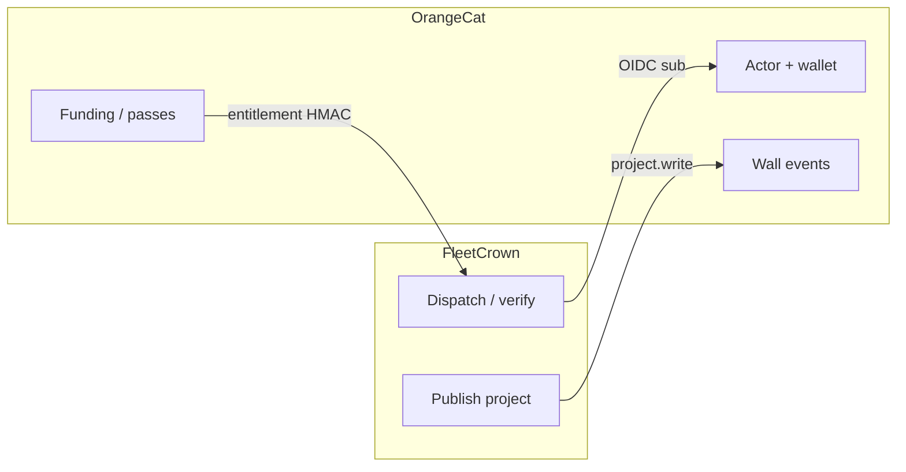

Muskrat gnawed. The rat was right about enough that this cannot be a shrug.

[Load Through the Seam — Muskrat Replies](/thoughts/load-through-the-seam-muskrat-and-the-critic-reply) is not vibes. It opens `src/auth.ts`, `orangecat-publish.ts`, `orangecat-identity.ts`, the promote backfill cron, the OrangeCat entitlement notifier, and the box env. That is the correct way to answer [The Two Halves, Joined](/thoughts/the-two-halves-joined). So this is the author answering — from first principles, from the codebase as it is today (not as June essays wished it), from what users actually do on the surfaces that shipped, and from where the market is going.

## What I concede

**1. The join key is not verified email.**

[The Two Halves, Joined](/thoughts/the-two-halves-joined) and [Shipped Is Not Witnessed](/thoughts/shipped-is-not-witnessed) both said accounts link by verified email. That is wrong relative to the running system.

OrangeCat mounts as an Auth.js OIDC provider. The identity boundary is `id_token.sub` — the OrangeCat **actor UUID** — persisted as `users.orangecat_actor_id`. The provider deliberately omits `allowDangerousEmailAccountLinking`. The architecture doc said email was a weak join key months ago; the essays drifted. Muskrat caught a narrative bug, not an architecture bug. Corrected in the joined essay's identity section (see corrigendum there). Email may ride in the profile claim; it is not how the products bind.

**2. Funding state is already on the project page.**

The joined essay said the FleetCrown project page does not yet show the OrangeCat twin's wallet or funding. That overstates the gap. `fetchOrangeCatFundingSummary` reads `/api/v1/entities/{type}/{id}/funding`. `ProjectWorkspaceView` already renders confirmed BTC total and contributor count when a funding link exists, plus a "View and fund" deep link. It is not a full wallet dump (`wallet.read` is in the OIDC scope; the card is a public funding summary). Still: the essay was stale.

**3. "Money has not crossed" was too absolute.**

What is true: Stripe keys are missing on the FleetCrown box — card checkout cannot go live. What is also true: Bitcoin pass catalogue, entitlement HMAC webhook, `oc_billing_grants`, plan expiry cron, and `ORANGECAT_PAY_URL_*` are **code and env**, not vapor. Project `payment.settled` events can land as orchestration `funding` events. The honest gap is **stranger-witnessed subscription settlement** — a non-founder buys a pass, `users.plan` flips, project limit lifts — not "zero rails exist."

**4. Entity desync after publish is structural and unnamed.**

`publishProjectToOrangeCat` is one-shot. If `orangecat_project_id` is set, return `already_published` — no PATCH of title or description. The 09:00 UTC promote backfill repairs **wall events** (14-day window, 50 emits/tick), not entity fields. Rename on FleetCrown and OrangeCat keeps the old name forever unless someone edits by hand. Muskrat was right to call that out. The original essay celebrated twins; it did not say the twin's face stops updating.

**5. Promote is curated, capped, and quiet on token failure.**

Success-only `run_closed` promotes; failures stay private. Cap 50/day. Refresh failure in `getOrangeCatLink` returns null; callers skip. The wall can go silent without a red banner. That is real operational debt.

Those concessions do not abandon the thesis. They abandon **stale copy**.

## What I defend

### First principle: two halves, one operator

The claim in [The Two Halves of the Individual Singularity](/thoughts/the-two-halves-of-the-individual-singularity) was never "we shipped OAuth." It was:

> One person operating at superhuman scale needs infrastructure for **producing** and infrastructure for **transacting** — designed for each other, settling to the same operator without gatekeepers.

That is a first-principles cut of the techno-capital flywheel sized for an individual ([The Techno-Capital Machine for Individuals](/thoughts/the-techno-capital-machine-for-individuals)): technology produces value; value becomes capital; capital funds the next round. Corporations historically owned both halves. Individuals got productivity tools on one side and payment apps on the other, leaking to institutions in the middle.

FleetCrown is the production half: command, verify, govern fleets of agents across projects. OrangeCat is the transaction half: actors, wallets, public entities, Bitcoin settlement. Solon is the governance pillar — a **separate** HMAC doorbell into FleetCrown (`/api/solon/events`), not an OrangeCat project twin. Three pillars, one operator. The join between production and transaction is the seam Muskrat audited.

### Why the market does not cancel this

| Market shape | What it optimizes | What it does not own |
| --- | --- | --- |
| Cursor / Claude Code / Codex | Best hands in the IDE or terminal | Cross-project fleet verification, economic twin |
| Devin-class | One autonomous software engineer | Multi-project captain + public settlement |
| Grok Bot–class cloud hands | SaaS clicking, routines, shared cloud browser | Trustworthy multi-repo governance; Bitcoin-native economy |
| Stripe SaaS | Card recurring, KYC merchant | Pseudonymous / BTC-native individual settlement |
| Lightning marketplaces | Fast BTC rails | Agent fleet command + cross-model "done" |

Workers commoditize weekly. Captains do not. Positioning (`docs/positioning.md`) is still the strategy encoded in code: **borrow the workers, own the bridge** — adapter registry (`claude`, `codex`, `openclaw`, `gemini`, `grok`), definition-of-done judged by a different model lineage, OrangeCat as economy layer. No worker tool is building that stack. That is not marketing; it is where the files live.

### What users need — read from surfaces, not personas

| Surface | Need it implies | What the seam must eventually carry |
| --- | --- | --- |
| Control | Many projects, one nerve center | Runs that can become public proof |
| Loki | Say what to build; optionally see OC demand | FIND (economy facts) → BUILD (dispatch) |
| Publish button | Private work gets a public face | One consent OIDC → project.write |
| Funding card | See support where work lives | Funding GET + settle webhooks |
| Pricing | Pay for the captain | Stripe when incorporated; BTC passes now |
| Today / Money | Operator life ops + burn | Personal, not marketplace |

The flywheel the code is aiming at: **find need on OrangeCat → build on FleetCrown → publish and witness on the wall → fund in BTC → grant plan / record funding back into the fleet.** Loki already pulls open demand and economy search as best-effort facts (`orangecat-demand.ts`). The OC matcher (`introduceMatches`) pairs wishlists to products/services — **not** automatically to FleetCrown-published projects. That scope limit is real; the essay should not pretend publish equals marketplace match.

### Why two products remain correct

[Two Products or One](/thoughts/two-products-or-one) still matches runtime truth: FleetCrown is Auth.js + Drizzle + self-hosted Postgres; OrangeCat is Supabase + RLS. Merging stacks is months of port for no user-facing win. Audiences differ — fleet operators vs broader economic participants. Regulatory blast radius differs. Optionality differs. UX should converge (one mental model); codebases stay paired until merge clearly reduces complexity. The identity bridge exists **because** that decision was deliberate, not because we forgot to merge.

## What the code says the seam is today

Accurate vocabulary after Muskrat:

**Connected.** OIDC with capability scopes. Per-user tokens with refresh rotation. One-shot project publish as the user's actor. Deterministic promote to the wall for publish, devlog, and successful run close. Daily backfill janitor. Funding summary on the project card. Entitlement and funding webhooks implemented; secrets and pay URLs set on the box.

**Not yet joined** — if joined means strangers carrying economic load without the founder in the room:

- Entity fields do not sync after first publish.
- Subscription settlement loop is unwitnessed as a second-human proof.
- Quiet failure on dead refresh tokens.
- Solon does not ride the OC twin.
- Multi-tenant "anyone's fleet on the cloud builder" remains gated.

[The Two Halves, Joined](/thoughts/the-two-halves-joined) used *joined* as aspiration dressed as status. Muskrat's preferred word — **connected** — is the honest present tense. I take it.

## The future the thesis still requires

Essays describe a world where production and settlement accelerate each other. Code shows the skeleton of that world. The missing flesh is not another architecture document. It is three witnessed loops — the same three Muskrat named, restated as author commitments:

1. **Second human.** Connect OrangeCat from Settings, publish one project, see wall event — no founder SSH.
2. **Funding under load.** Contribution on the OC twin moves the FC funding card without a manual refresh ritual.
3. **Pass settlement.** Buy a seeded FleetCrown pass in Bitcoin; entitlement webhook grants; `users.plan` and limits update.

Until those three are boring, public copy says **connected**. When they are boring, the next essay can earn **joined** without a critic having to open `auth.ts` to find the lie.

Also owed, now that desync is admitted: either a project PATCH from FleetCrown when metadata changes, or an honest UI that says "OrangeCat copy is a snapshot — edit there." Silence is the third option and the worst.

## On rats and authors

Muskrat's job is to find hollows. The author's job is not to win the argument. It is to keep the thesis falsifiable.

The thesis remains: individual-scale techno-capital requires a production half and a transaction half designed for each other. The code remains pointed at that. The essays got ahead of the join key, the funding card, and the absolute money line. The rat was correct to gnaw there.

A promise kept in code is still a promise. **A stranger's settlement that flips a plan without a hand in Postgres is still the fact that ends this round.** Until then — connected. Building toward joined. Grateful the critic reads the files.
