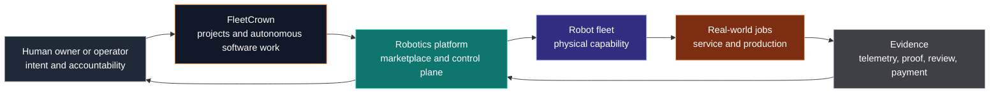

## The Threshold

There is a simple condition that changes what FleetCrown is.

I should be able to open it on my phone or any computer, sign in, see every active project, understand what is happening, and make the next decision. If I am away from the desk, the loop should not collapse. If an agent finishes work, FleetCrown should know. If a high-quality, context-aware next step is safe to execute, it should be able to continue. If a decision needs me, I should be able to make it from wherever I am.

That is why the database and authentication are not background infrastructure tasks. They are the threshold.

Without durable data, FleetCrown cannot reliably remember the work. Without sign-in that works end to end on desktop and mobile, it is still a local experiment wearing a web interface. Until both are stable, every grander feature is downstream of uncertainty.

The order is therefore precise:

1. Make account creation, sign-in, OAuth, password recovery, sessions, and mobile access work reliably.
2. Move the data layer onto infrastructure that does not disappear under normal product traffic, with backups, encryption, monitoring, and a restore path.
3. Prove that I can operate projects through FleetCrown from anywhere.
4. Make autonomous continuation trustworthy: strong handoffs, context-aware prompts, bounded permissions, verification, logs, and clear escalation to a human.
5. Launch the first new project initiated and managed entirely through FleetCrown.

That first project should be the platform for a shared robotics economy.

## Why This Is the Next Project

Software agents change the economics of building software. They can inspect, write, test, fix, document, and deploy while a human sets direction and judges outcomes. A good control plane means productive work is no longer limited to the hours when I am physically sitting at a terminal.

Robots extend the same idea into physical work.

Today, a robot is commonly treated as a capital asset: expensive to buy, narrow in purpose, useful only to its owner, and idle whenever the owner does not have the right job ready. That is the same waste pattern we have already learned to recognize in computing: machines sitting still while work exists elsewhere.

The opportunity is to build the market and control layer that makes robotics capacity available when and where it is useful:

- manufacturers can sell new robots into an active market;
- owners can resell equipment that no longer fits their needs;
- businesses and households can rent or lease robots instead of buying immediately;
- owners can book out idle capacity for paid jobs;
- customers can request work rather than understand every robot model;
- operators can monitor jobs, maintenance, safety, payments, insurance, and accountability from one place.

The simplest insight is strong: **a useful robot should not be unnecessarily idle when safe, valuable work is available.**

That does not mean physical machines should act without boundaries. It means scheduling, marketplaces, maintenance, permissions, and supervision can raise utilization while respecting people, property, law, and safety.

## From Agent Fleet to Robot Fleet

FleetCrown already points toward the architecture needed for robotics. A software agent and a physical robot are not the same thing, but the control questions rhyme:

- What is the machine capable of?
- What job has it been asked to do?
- Who is authorized to direct it?
- What state is it in now?
- What evidence shows the job was completed correctly?
- What can continue automatically?
- What requires a human decision?
- What happens if it fails, disconnects, damages something, or reaches a boundary?

The software version begins with prompts, repositories, tests, commits, and deployments. The physical version adds location, hardware capability, battery, maintenance, telemetry, identity, insurance, environmental constraints, and safety interlocks.

This is why launching the robotics platform through FleetCrown matters. It is not just another product idea placed in a backlog. It is a test of the thesis: can a control plane for intelligent work reliably create the next control plane for physical capability?

## What "Autonomous" Must Mean

There is a seductive but incomplete version of the vision: go to sleep, wake up, and find that AI has made every project perfect.

The real version is more demanding. A system earns more autonomy only when it shows better judgment, better evidence, and better reversibility.

For FleetCrown, high-quality autonomous work means:

- it understands the current mission and the most important user-blocking problem;
- it does not repeat comfortable cleanup work while authentication or database reliability remains broken;
- it names why it selected one task over another;
- it verifies its changes through tests, browser flows, builds, and deployed checks;
- it commits traceable work and reports exactly what happened;
- it stops and requests a human action where credentials, payments, production risk, policy, or irreversible choices are involved.

For a robotics platform, the requirements become stricter:

- every robot, operator, customer, and job has verified identity;
- robots expose capabilities and prohibited uses explicitly;
- work is geofenced, permissioned, observable, interruptible, and logged;
- safety-critical motion is governed by tested hardware and software interlocks, not model confidence alone;
- insurance, maintenance, incident reporting, and dispute resolution are part of the product;
- no customer can use the platform to harm people, intimidate communities, or evade responsibility.

The competitive goal is not domination through force. It is building the most useful, trusted, and widely deployed productive robotics network. The winning network will be the one people trust with real work because it is economical, available, transparent, and safe.

## The Marketplace Primitive

The first version should not try to build every robot. It should make robot ownership and access liquid.

The marketplace can begin with five transaction types:

1. **Buy new**: manufacturers and distributors list robotics hardware with clear capabilities, service requirements, and compatibility data.
2. **Buy used**: owners resell robots with maintenance records, usage history, inspections, and supported-task classifications.
3. **Rent**: customers book a robot for short jobs or trials without long-term capital commitment.
4. **Lease**: businesses adopt recurring robotic capacity with service and maintenance included.
5. **Book capacity**: a robot owner offers available time slots for jobs, turning unused equipment into revenue.

The important abstraction is not the listing. It is **available capability**.

A customer may not want "Robot Model Z7." They want:

- move materials in a warehouse for four hours;
- mow a property this week;
- inspect solar panels;
- clean floors overnight;
- photograph crops;
- assist with repetitive lifting under supervision.

The platform should eventually match jobs to eligible robots based on capability, distance, availability, operator requirements, safety constraints, total cost, reliability, and proof of completion.

This creates a practical flywheel:

- more owners list robots because idle time becomes revenue;
- more customers book robots because supply becomes accessible;
- more manufacturers sell robots because the asset has a resale and earning path;
- more usage data improves maintenance, task matching, and financing;
- better utilization lowers the cost of useful robotic work.

## What We Own

There are two complementary ambitions.

The first is to build the platform: the place where many people and organizations can safely make productive robotics capacity available.

The second is to own a meaningful fleet ourselves.

Owning robots matters because it gives direct operational truth. A marketplace that never operates its own inventory risks becoming a listings website that does not understand uptime, repairs, customer expectations, charging, transport, supervision, or the hard edge of reliability.

Our own fleet would serve three purposes:

- supply liquidity where the marketplace is initially thin;
- prove operational standards before asking others to trust them;
- generate firsthand knowledge about which jobs and machines actually create value.

But ownership must serve the platform mission: useful capability, responsible deployment, and real customer outcomes. The objective is not a force. It is a fleet that earns trust by doing valuable work reliably.

## What FleetCrown Must Prove First

Before commissioning this platform, FleetCrown has one immediate job: become reliable enough to be its birthplace.

The proof is concrete:

- I can create or access my account from desktop and phone.
- I can sign in again tomorrow without depending on a local owner shortcut.
- My projects remain visible because the production database is durable and monitored.
- I can add this robotics-platform project through the product itself.
- I can dispatch an agent from FleetCrown and see its work, handoff, tests, and deployment state.
- I can step away and allow bounded next-best-step work without losing control of priorities.

This is not a delay to the bigger idea. It is the first construction step. If FleetCrown cannot reliably control one new project from a phone, it has no business becoming the control plane for a robotics marketplace.

## The First Commission

Once authentication and database reliability are proven, the next act is deliberately symbolic and practical:

Create the robotics-platform project inside FleetCrown.

Write its mission there. Create its initial roadmap there. Dispatch its first implementation work there. Review and steer it from a phone when possible. Let the project be born inside the system it is meant to extend.

Its earliest milestones are likely to be modest:

1. Define the marketplace domain: robots, capabilities, listings, owners, jobs, bookings, availability, maintenance records, payments, and safety requirements.
2. Build the first web surface for listings and requests, before attempting physical integration.
3. Choose an initial narrow category of robots and work where capability and safety are understandable.
4. Design verification, insurance, identity, and incident handling before scaling transactions.
5. Enroll real hardware only when the platform can represent its limitations honestly.

The scope should stay disciplined. The ambition is enormous; the first product must be small enough to work.

## A Compounding Future

FleetCrown began as a way to direct software agents. The reason to fix its database and authentication now is that reliability turns a local workflow into a portable operating system for projects.

Once that system works, it can be used to create more capable systems: software that improves software, agents that build better tools for agents, and eventually platforms that coordinate useful physical machines in the world.

This is the compounding mechanism that matters. Not autonomy without supervision. Not activity mistaken for progress. It is intelligence coupled to context, evidence, responsibility, and increasingly powerful tools.

A phone-controlled FleetCrown that can reliably build and manage a shared robotics platform is a meaningful step in that direction.

The immediate task is unglamorous and decisive: make database and authentication work completely.

Then create the first new project from inside FleetCrown.

Then make useful machines easier to access, safer to deploy, and harder to leave idle.
