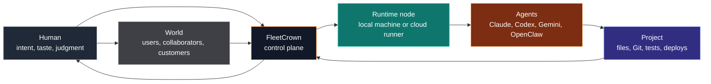
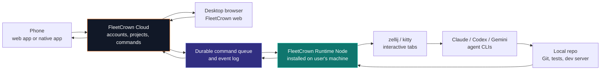
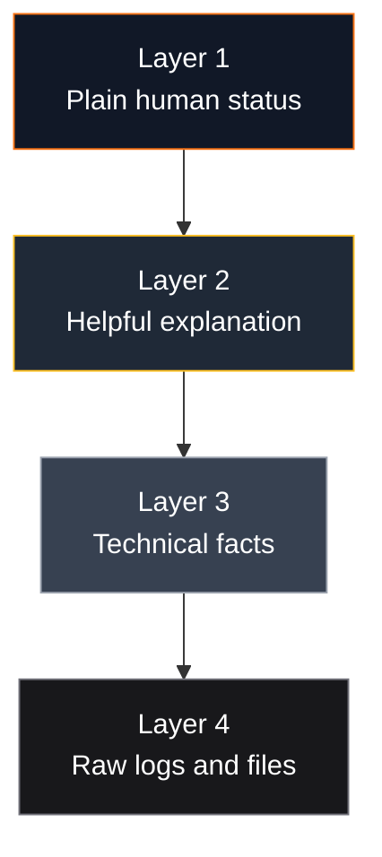
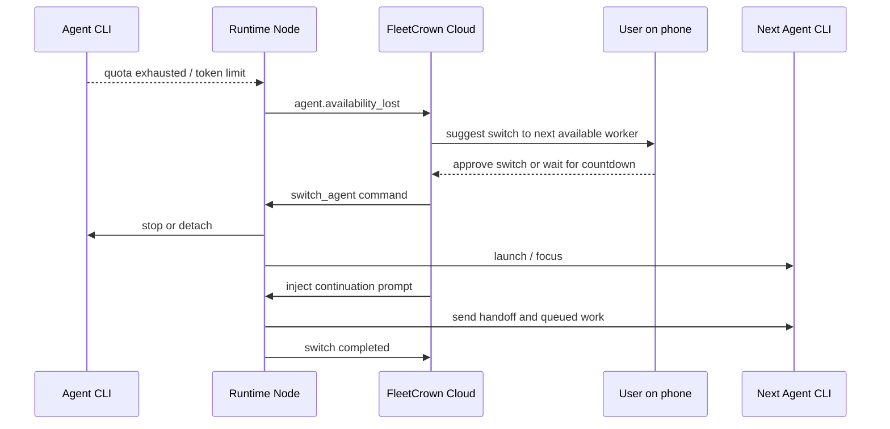
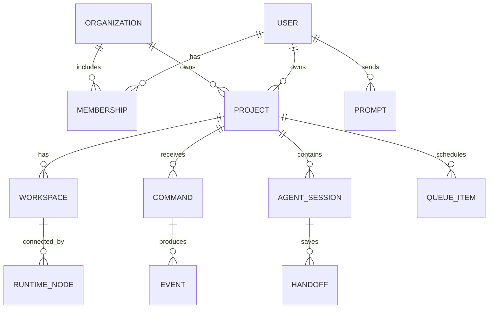
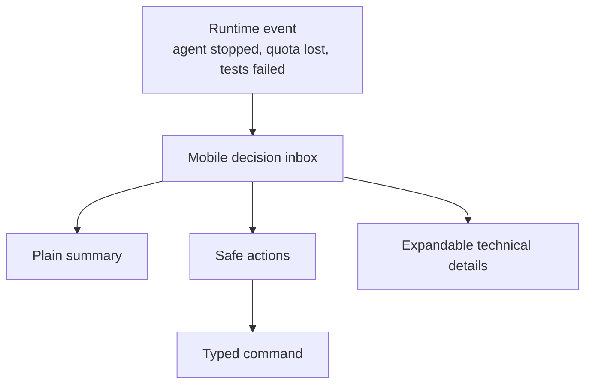

## The Walk Test

The real test for FleetCrown is not whether it can inject a prompt into a terminal while you are sitting at the desk.

That is useful. It is also table stakes.

The real test is this:

You leave your computer at home. You go for a walk, or a bike ride, or you sit somewhere away from your machine. Your phone buzzes. The system says the current agent has stopped. Maybe it finished the task. Maybe it hit a token limit. Maybe it needs a decision. You open FleetCrown from your phone, read the handoff, inspect the changed files at the right level of detail, choose what should happen next, and send the next instruction into the same development loop you would have controlled from your desk.

Then you put the phone away.

The work continues.

That is the product. Not a dashboard. Not a terminal wrapper. Not a clever prompt launcher. FleetCrown wants to become a portable control layer for human-machine creation.

The word "portable" matters. It means the creative process is no longer trapped inside one physical sitting position. It means a project can stay alive while the human moves through the world. It means the human is still in charge, but the work is no longer serialized by the human staring at a terminal.

The word "control" matters even more. The goal is not to let autonomous systems make irreversible messes. The goal is to make intent, execution, review, collaboration, and continuation feel like one coherent system.

The first primitive version of this is local. It runs on localhost. It knows about zellij, kitty, Claude, Codex, Gemini, Git, prompt history, handoff files, and the strange reality of real development machines. That local version is not a mistake. It is the laboratory where the product discovers the shape of the truth.

But localhost is not the destination.

The destination is a cloud account connected to enrolled runtime nodes, with a phone-friendly cockpit, collaboration, identity, permissions, audit trails, and a public surface where builders can show the work they are doing.



This article is the blueprint: where FleetCrown is now, what the ideal version looks like, what not to build too early, and what the next correct baby steps are if we want the future without burying ourselves in tech debt.

## The Thing We Are Actually Building

The easy description is "a web app that controls agents."

That description is too small.

FleetCrown is trying to become an operating layer for creative work where humans and machines collaborate continuously. It should understand projects, workspaces, prompts, agent sessions, queues, handoffs, changes, tests, deployments, collaborators, and long-running goals. It should make the next right action visible. It should make dangerous actions explicit. It should make progress inspectable by non-technical people without flattening away the technical detail experts need.

The product is not the agent.

The product is the layer above the agent.

Agents will change. Claude, Codex, Gemini, OpenClaw, local models, cloud models, specialized code agents, design agents, test agents, security agents, and robotics agents will all rotate in and out. The cockpit should survive that churn. It should treat each agent as a capable but replaceable worker attached to a project.

The product is also not the terminal.

Terminals are powerful because they expose reality. They are also unforgiving, linear, and optimized for people who already understand them. A good cockpit does not hide the terminal. It translates the terminal into decisions:

- What is currently happening?
- What changed?
- What needs human judgment?
- What can safely continue?
- What is blocked?
- Which worker should take over?
- Who else is allowed to steer this project?
- What is the audit trail?

For a technical user, the system should still reveal the raw facts: branch, dirty files, process state, logs, commands, prompts, test output, timestamps, adapters, run IDs, and handoff files.

For a non-technical user, it should explain those facts in product language:

- "There are 58 pending changes" becomes "The agent changed 58 files that have not been saved as a checkpoint yet."
- "main" becomes "You are working directly on the primary line of the project."
- "Runtime: Codex" becomes "This workspace is currently controlled by Codex."
- "OpenClaw timed out" becomes "A background planning worker ran too long and was stopped. Your main agent is not blocked."

That distinction is not cosmetic. It is the difference between a tool for terminal-native engineers and a product that can bring more humans into building.

## Status Quo

FleetCrown today is a local-first control surface.

That is both its strength and its limitation.

It has access to things a cloud app usually cannot see: local agent processes, zellij tabs, terminal names, Git working trees, local files, shell scripts, stop hooks, beacon popups, prompt queues, handoff markdown, and transient state in `/tmp`. It can do real work because it sits close to the work.

It also inherits the messiness of the local machine. Truth is scattered across files, processes, browser localStorage, database tables, terminal sessions, hook scripts, and UI state. Some of those sources are stable. Some are opportunistic. Some are historical artifacts that became load-bearing because they worked during prototyping.

The current system already contains several important building blocks:

- A Control page that shows projects and lets the user send prompts.
- Agent registry and preference code for choosing default agents and models.
- Prompt history and orchestration run tables.
- Local injection routes that can send text into a terminal tab.
- Beacon popups that appear when an agent stops and can auto-continue work.
- Queues for pending prompts.
- Session handoff files that summarize what happened and what should happen next.
- Project state records and activity logs.
- Early support for multiple agents and adapters.

This is not nothing. It is a working laboratory.

But it is not yet the remote, collaborative, mobile, trustworthy system described by the walk test.

Today, the user still has to care too much about implementation artifacts. A card may say "latest orchestrated run" when that run was an OpenClaw background task, not the interactive agent the user thinks they are controlling. A tile may show "Runtime: Codex" without making clear whether that came from a process detector, a preference file, a selected frontend default, or a stale handoff. "59 pending changes" may be accurate and still not helpful if the user does not know whether that is normal, dangerous, reviewable, committable, or caused by unrelated local edits.

That is the honest status quo:

Powerful, local, promising, but still too leaky.

## What Localhost Gets Right

It is tempting to jump straight to cloud accounts, mobile apps, and collaboration. That future is real, but skipping the local phase would be a mistake.

Localhost gets four important things right.

First, it keeps execution close to the tools developers already use. The agent runs in the real project directory. It uses the real Git checkout. It can interact with the same terminal environment, dotfiles, credentials, CLIs, and dev servers the human uses.

Second, it exposes the real problems. Token exhaustion, stale terminal sessions, duplicated auto-continue loops, ambiguous state labels, dirty working trees, agent-specific command syntax, and inconsistent popups are not theoretical. They show up immediately when the system touches a real workflow.

Third, it avoids building the wrong cloud too early. A cloud runner platform is expensive, security-sensitive, and easy to overfit around assumptions that local usage would disprove within a week.

Fourth, it preserves user agency. The user can always drop into the terminal and inspect what happened. That matters while the product is still learning.

The local version is not the toy version. It is the seed crystal.

## Where Localhost Breaks

Localhost breaks the moment the human leaves the machine.

If FleetCrown only runs on `http://localhost:3000`, the phone cannot reach it from the forest. A collaborator cannot join from another city. A second device cannot reliably continue a session. A profile cannot become a public builder surface. Notifications cannot become dependable product events. Permissions cannot be enforced across humans because there is no shared control plane.

Localhost also breaks conceptually when the system needs to coordinate multiple actors.

A single-machine dashboard can get away with reading process state directly and rendering it. A collaborative system cannot. It needs durable command history, identity, permission checks, audit logs, conflict handling, invitations, project membership, and explicit ownership of runtime nodes.

The question is not whether FleetCrown eventually needs accounts.

It does.

The question is when and how to introduce accounts without turning a promising local tool into a half-built SaaS shell that cannot actually execute work.

The wrong answer is to build a giant cloud platform before the local runtime boundary is clean.

The right answer is to make the local runtime enrollable.

## The Wrong Leap

The seductive mistake is to say: "If the future is remote, put everything in the cloud now."

That sounds clean. It is not.

A full cloud runner system means FleetCrown must host source checkouts, credentials, dependency installs, dev servers, agent CLIs, secret management, artifact storage, browser sessions, network access, billing, isolation, sandboxing, and abuse prevention. It must solve multi-tenant execution before it has even finished clarifying what a "Continue" button should do.

That is too much surface area too early.

It also risks losing the thing that makes FleetCrown useful right now: it controls the user's real working environment. The user's machine already has the repo, the SSH keys, the Git identity, the package manager cache, the terminal preferences, the local services, and the muscle memory. Throwing all of that away in favor of a premature cloud runner is not product maturity. It is amnesia.

Temporary tunnels are not the product either.

Tailscale, Cloudflare Tunnel, ngrok, SSH port forwards, and VPNs can be useful for dogfooding. They answer the personal question: "How can I reach my current localhost from my phone?" They do not answer the product question: "How should accounts, devices, projects, permissions, and runtime commands work for many users?"

A tunnel exposes an app.

A control plane coordinates work.

Those are different systems.

## The Right Bridge

The right bridge is a cloud control plane connected to local runtime nodes.

The cloud side owns identity, projects, collaboration, permissions, history, command queues, notifications, and public profile surfaces.

The local node owns execution. It runs on the user's machine. It can see zellij, kitty, the project directory, Git, tests, local CLIs, and agent processes. It connects outbound to the cloud, receives typed commands, executes only the capabilities it has advertised, and streams events back.

The phone does not need to connect to localhost.

The phone connects to FleetCrown Cloud. FleetCrown Cloud sends commands to the enrolled runtime node over an authenticated realtime channel. The runtime node executes the command locally and reports the result.



This is the important architectural inversion:

The cloud does not reach into the user's machine.

The user's machine reaches out to the cloud.

That is simpler to deploy, easier to secure, and friendlier to home networks. No port forwarding. No open inbound socket. No assumption that the phone can see the laptop. The runtime node keeps an outbound WebSocket or similar connection alive. If the connection drops, commands wait. When the node reconnects, it resumes.

This is the smallest architecture that supports the vision without pretending every user should become a network engineer.

## A Product Translation Layer

The technical architecture is only half the work.

The other half is language.

FleetCrown is full of facts that are meaningful to engineers and confusing to everyone else:

- Runtime
- Branch
- Dirty worktree
- Handoff
- Orchestrated run
- Adapter
- Queue
- Beacon
- Prompt injection
- Terminal tab
- Auto-continue
- Token exhaustion

These words are not bad. They are just the wrong first layer for many users.

The product should teach without humiliating. A non-technical user should be able to hover, tap, or expand and learn the underlying concept at the moment it matters.

The first sentence should be human:

"The agent changed 59 files that have not been saved as a checkpoint."

The second layer can teach:

"Developers call this an uncommitted working tree. It means the files changed locally, but Git has not recorded them as a commit yet."

The third layer can be raw:

```
branch: main
status: 59 changed files
commit: none
```

The same pattern should apply to every confusing card element:

- "Agent open" should explain whether an app window is open, a CLI process is running, or the system merely has a saved session.
- "Open with Codex" should explain whether it launches a new terminal, focuses an existing tab, or switches the default worker.
- "Last handoff" should explain that it is the most recent saved summary from an agent session.
- "Latest orchestrated run" should say whether it affected the current workspace or was a background planner.
- "main" should explain branch risk in plain language.

The goal is not to remove technical truth.

The goal is to layer it.



This matters because the long-term user is not only a senior engineer.

The long-term user is a founder, designer, researcher, student, operator, educator, scientist, artist, or builder who can direct intelligent systems but may not yet speak terminal fluently. FleetCrown should help them become more capable over time.

## The Agent Is a Worker, Not the Brain

One earlier UI phrase was "Active brain."

That phrase is emotionally appealing and technically dangerous.

If the UI says Claude is the brain, what happens when Claude runs out of tokens and Codex takes over? Did the project lose its brain? Did the user's intention change? Did the system become a different product?

No.

The human remains the brain. The project has workers.

The agent is a worker, executor, assistant, or runtime participant. It has capabilities and constraints. It may be preferred, unavailable, rate-limited, paused, stale, or replaceable. The UI should make switching workers simple, but it should not imply the agent owns the project.

A better mental model:

- The human owns intent.
- FleetCrown owns coordination.
- The runtime node owns execution.
- Agents own temporary work.
- Git owns checkpoints.
- The event log owns memory.

When Claude runs out of credits, that is not a catastrophic product state. It is a worker availability event. The system should say:

"Claude is unavailable right now. Codex is available. Continue this project with Codex?"

If the user does nothing and auto-switch is enabled:

"Claude is unavailable. Continuing with Codex in 10 seconds."

The popup, web app, and future mobile app should share the same decision model. Different surfaces, same state machine.

## Token Exhaustion Is a First-Class Event

Token exhaustion is not an edge case. It is one of the most common reasons a real agent workflow stops.

In human terms, it means:

"This worker cannot continue right now."

In system terms, it should become a structured event:

```
event.type = "agent.availability_lost"
event.reason = "quota_exhausted"
event.agent = "claude"
event.project = "cockpit"
event.detectedBy = "runtime_node"
event.nextAvailableAgents = ["codex", "gemini"]
```

The current manual recovery flow is familiar:

1. Notice Claude or Codex ran out.
2. Go to the terminal.
3. Quit the current CLI.
4. Start another CLI.
5. Re-orient it with context.
6. Continue manually.

FleetCrown should compress that into one decision:

"Switch worker and continue from the latest handoff."

That decision should be available from the project card, the expanded project detail, the popup, and mobile notifications.

The automatic version should be opt-in and transparent:

1. Primary worker fails because of quota.
2. Runtime node detects the failure pattern.
3. FleetCrown records an availability event.
4. UI offers the next preferred available worker.
5. If auto-switch is enabled, the countdown starts.
6. The runtime node stops or detaches the old worker.
7. The runtime node launches or focuses the next worker.
8. FleetCrown injects the latest handoff plus the pending queue item.
9. The event log records the switch.



This is how the system becomes continuous without becoming reckless.

## Technical Deep Dive: The Runtime Node (Safe to Skip)

The runtime node is the bridge between cloud intent and local execution.

It should be a small, explicit process installed on the user's machine. It might begin as the existing Next app plus local scripts. Over time, it should become a separate daemon with a narrow API.

Its responsibilities:

- Identify the machine and authenticate to FleetCrown Cloud.
- Advertise capabilities for each enrolled workspace.
- Maintain an outbound realtime connection.
- Receive typed commands.
- Validate that commands are allowed.
- Execute local adapters for zellij, kitty, Git, tests, and agent CLIs.
- Stream events and logs back to the control plane.
- Refuse commands outside its capability model.

Its non-responsibilities:

- It should not own product identity.
- It should not decide collaboration permissions.
- It should not expose arbitrary shell execution to the cloud.
- It should not store the canonical project history.
- It should not invent UI copy.

The runtime node should be boring. Boring is good. It should do small commands reliably.

Example command envelope:

```json
{
  "id": "cmd_01HV...",
  "projectId": "proj_cockpit",
  "workspaceId": "ws_home_macbook",
  "type": "inject_prompt",
  "requestedBy": "user_g",
  "createdAt": "2026-05-14T10:12:00.000Z",
  "idempotencyKey": "proj_cockpit:queue_item_123",
  "payload": {
    "target": {
      "agent": "codex",
      "tab": "cockpit"
    },
    "prompt": "Continue from the latest handoff and run the focused tests."
  }
}
```

Example event stream:

```json
{
  "commandId": "cmd_01HV...",
  "type": "command.completed",
  "workspaceId": "ws_home_macbook",
  "observedAt": "2026-05-14T10:12:04.000Z",
  "summary": "Prompt injected into cockpit tab controlled by Codex."
}
```

The important detail is not the exact JSON.

The important detail is that every command has identity, permission context, idempotency, project scope, runtime target, payload, and resulting events. That is what lets a phone, web app, popup, and future native app all speak the same language.

## Technical Deep Dive: Typed Capabilities, Not Remote Shell (Safe to Skip)

The dangerous version of remote FleetCrown is a button on the phone that can run any shell command on the home machine.

Do not build that.

The correct primitive is a typed capability system.

The runtime node advertises capabilities:

```json
{
  "workspaceId": "ws_home_macbook",
  "capabilities": [
    "focus_workspace",
    "inject_prompt",
    "launch_agent",
    "stop_agent",
    "switch_agent",
    "read_git_status",
    "list_changed_files",
    "read_handoff",
    "run_configured_test",
    "create_checkpoint_commit"
  ]
}
```

The cloud only sends commands that match those capabilities. Each command has a schema. Each schema is narrow. The node validates it before execution. Some commands require human confirmation. Some can be automated.

For example, `inject_prompt` is relatively safe if scoped to an enrolled workspace and an existing terminal tab. `create_checkpoint_commit` is more sensitive because it modifies Git history. `push_branch` is more sensitive again because it sends code to a remote. `run_arbitrary_shell` should not exist as a general cloud command.

This preserves power while keeping the blast radius understandable.

The system can still run tests. It can still commit. It can still deploy. But those actions should be configured project capabilities, not arbitrary strings arriving from the internet.

## Technical Deep Dive: The Control Plane (Safe to Skip)

The control plane is the shared product brain.

It should own durable truth:

- Users
- Accounts
- Profiles
- Organizations
- Projects
- Workspaces
- Runtime nodes
- Capabilities
- Commands
- Events
- Prompt history
- Agent sessions
- Handoffs
- Queue items
- Collaboration permissions
- Notifications
- Public project updates

It should not directly own local execution details. It should not know how to press keys in zellij. It should not parse every terminal escape sequence. It should record what the runtime node reports through stable contracts.

At the product level, this becomes the source of truth:



This is not a prescription to build every table immediately.

It is a map of where truth should eventually live.

The baby-step version can still use the existing database and local files. But every new feature should move toward this separation:

- Product state in the control plane.
- Execution state in runtime adapters.
- Temporary local facts reported as events.
- UI surfaces derived from the same typed records.

That is how we avoid having one card read Git directly, another read a handoff file, another read prompt history, and another invent a status from a stale process scan.

## The Single Source of Truth Problem

The phrase "single source of truth" is easy to say and hard to earn.

FleetCrown has already felt this pain. A queue can appear in a file, browser state, React state, a popup process, and a backend route. An agent status can come from `/proc`, a zellij tab, a user preference, an orchestration run, or a session handoff. A project card can show facts from multiple layers without explaining their provenance.

That is how a UI starts to feel like it is lying even when each individual value is technically defensible.

The solution is not to hide data.

The solution is provenance.

Every status shown to the user should answer:

- What is the claim?
- Where did it come from?
- How fresh is it?
- What does it mean?
- What should the user do?

For example:

Claim: "Agent open"

Possible sources:

- A process matcher found a running Codex process.
- A zellij tab named `cockpit` exists.
- A saved session file exists.
- The user selected Codex as the preferred worker.

Those are different claims. They should not collapse into one ambiguous badge.

A better card says:

"Codex tab is open. No active prompt is running."

Hover detail:

"Detected from zellij tab `cockpit` and local process scan 12 seconds ago."

This is the kind of polish that makes the system feel trustworthy.

## Collaboration Changes the Shape

Once another person can join a project, almost every local shortcut becomes a product question.

Who can send a prompt?

Who can switch the agent?

Who can approve a commit?

Who can see logs that may include secrets?

Who can invite another collaborator?

Who can stop an agent that is currently running?

Who can take over when the project owner is offline?

Collaboration is not just shared viewing. It is shared authority. That means permissions need to map to actions, not just pages.

Early roles can be simple:

- Owner: full control of project, workspace enrollment, collaborators, and publishing.
- Maintainer: can run agents, review changes, commit, push, and manage queues.
- Contributor: can propose prompts, inspect status, and comment, but sensitive actions require approval.
- Viewer: can read public or shared progress but cannot execute commands.

This is enough to start. It does not need enterprise policy machinery on day one.

The important thing is that every command has `requestedBy`, every event has an actor, and every sensitive action has an approval path.

That is how collaboration becomes trustable instead of chaotic.

## The Builder Network

Accounts and profiles are not only for login.

They are the foundation for a builder network.

If FleetCrown records projects, prompts, handoffs, commits, shipped features, lessons, collaborators, and public updates, then a profile can become much more interesting than a resume. It can become a living proof-of-work surface.

Not vanity metrics. Not empty posting. Actual creation history.

A builder profile could show:

- Projects currently being built.
- Public milestones.
- Technical writeups.
- Prompt libraries.
- Agent workflows.
- Collaborators.
- Contributions to other projects.
- Open invitations for help.
- Shipped artifacts.
- Lessons learned.

The social network part should emerge from work, not distract from it.

The most valuable feed is not "what people are saying."

It is "what people are making, what they learned, and where help would matter."

This connects directly to the larger vision: more humans contributing to the next wave of creation, even if they are not traditional software engineers. AI lowers the cost of execution. FleetCrown should lower the cost of steering, reviewing, learning, and collaborating.

## Mobile Is Not a Smaller Desktop

The mobile version should not simply compress the current dashboard.

On a phone, the primary unit is a decision.

The app should show:

- What happened?
- Is anything blocked?
- What changed?
- What is the safest next action?
- What requires approval?
- Can I delegate this to another worker?
- Can I ask a collaborator?

The desktop can show dense panels. The phone should show an operational inbox.

Example mobile notification:

"FleetCrown stopped after updating the Control card. 59 files changed. Tests not run. Continue with Codex?"

Tap opens:

1. Summary of the handoff.
2. Change risk level.
3. Buttons: Continue, Test and fix, Review changes, Switch worker, Stop.
4. Expandable technical details.

The same command model powers all surfaces. The UI changes by context.



This is also where popups and the web app should converge. A popup is just a small decision surface. It should not have a separate state machine from the web app. It should render the same choices from the same session record.

## The UX Principle: Explain Without Slowing Down Experts

There is a design tension at the heart of FleetCrown.

Experts want density, speed, keyboard shortcuts, raw logs, branch names, diffs, model names, test commands, and precise state.

Newer users want confidence, plain language, guardrails, and a sense of what the machine is doing on their behalf.

The answer is progressive disclosure, not two separate products.

Every important UI element should have:

- A plain label.
- A short status sentence.
- A helpful hover or tap explanation.
- A deeper details view.
- A raw technical escape hatch when needed.

For example, the Git status pill should not merely say:

"59 pending changes"

It should say:

"59 unsaved project changes"

Hover:

"The agent changed files locally. They are not recorded as a Git checkpoint yet. Review them before committing or switching major tasks."

Details:

- Branch: main
- Changed files: 59
- Staged files: 0
- Last commit: 0bde5c9
- Suggested action: review changes, then create checkpoint

That is not dumbing down. That is good product design.

## Security Is Product Design

Remote control of a development machine is powerful. That power is the point. It is also the risk.

Security cannot be bolted on after the mobile app works.

The minimum security model should include:

- Account authentication.
- Runtime node enrollment with device tokens.
- Per-project permissions.
- Typed command schemas.
- Capability allowlists.
- Audit logs for every command.
- Confirmation requirements for sensitive actions.
- Secret redaction in logs.
- Local approval for first-time workspace enrollment.
- Revocation for lost devices.
- Clear indication of which machine will execute a command.

The user should never wonder:

"Which machine did I just control?"

The UI should say:

"Executing on g's MacBook in `/home/g/dev/cockpit`."

For non-technical users:

"This command will run on your home computer in the FleetCrown project."

Security is not only cryptography. It is also comprehensibility.

## What to Build First

The north star is ambitious. The next step should be small.

The correct next step is not "build the entire cloud social network."

The correct next step is to define the runtime boundary locally and route one real action through it.

Start with prompt injection.

Today, a frontend action may call a route that knows too much about the local injection mechanism. Instead, create a typed internal command:

```
type RuntimeCommand =
  | { type: "inject_prompt"; workspaceKey: string; agent: Agent; prompt: string }
  | { type: "focus_workspace"; workspaceKey: string }
  | { type: "read_git_status"; workspaceKey: string }
```

Then implement a local runtime executor:

```
executeRuntimeCommand(command)
  -> validate command
  -> call local adapter
  -> emit event
```

At first, this all runs in the same local app.

That is fine.

The important move is architectural: the UI stops depending directly on local implementation details. It sends a command. A runtime executor handles it. Events come back.

Later, the executor can move into a daemon. Later still, the command can arrive from the cloud. The product surface does not need to be rewritten because the command contract already exists.

This is the baby step that preserves the future.

## A Practical Roadmap

The roadmap should move in layers.

1. Make the local FleetCrown honest.
2. Introduce a runtime command abstraction.
3. Store command and event history durably.
4. Unify web, popup, and control-panel decisions around the same state machine.
5. Add local runtime node identity.
6. Add account login and cloud project records.
7. Enroll the local machine into the cloud account.
8. Send one command from cloud to local over an outbound connection.
9. Build the mobile decision inbox.
10. Add collaboration permissions.
11. Add public builder profiles.
12. Add optional cloud runners as another runtime node type.

```mermaid
flowchart LR
    A["Local truth cleanup"]
    B["Runtime command boundary"]
    C["Durable event log"]
    D["Outbound local node"]
    E["Cloud account"]
    F["Phone control"]
    G["Collaboration"]
    H["Builder network"]
    I["Cloud runners"]

    A --> B --> C --> D --> E --> F --> G --> H --> I

    style A fill:#111827,stroke:#f97316,color:#fff
    style B fill:#111827,stroke:#f97316,color:#fff
    style C fill:#1f2937,stroke:#fbbf24,color:#fff
    style D fill:#0f766e,stroke:#5eead4,color:#fff
    style E fill:#312e81,stroke:#a5b4fc,color:#fff
```



The ordering matters.

If we build accounts before the runtime boundary, the cloud app will not know how to execute real work.

If we build mobile before the event model, the phone will be a pretty shell over ambiguous state.

If we build collaboration before permissions are action-based, we will create social chaos.

If we build cloud runners before local nodes are clean, we will duplicate complexity and hide the learning.

## The Ideal Version

In the ideal version, FleetCrown feels like a mission control surface for creation.

You have an account. You enroll your machine. FleetCrown knows which projects are available on that machine and which capabilities each workspace supports. You can open the web app from a laptop or phone. You can invite collaborators. Each collaborator has clear permissions. Every command is recorded. Every agent handoff is readable. Every change is reviewable. Every risky action asks for the right level of confirmation.

When an agent finishes, FleetCrown summarizes what happened and presents the next decision.

When an agent runs out of credits, FleetCrown suggests the next available worker.

When a collaborator joins, they see the project state, not a pile of terminal trivia.

When a project ships, the work can appear on the builder's profile.

When someone wants to learn how something was built, they can inspect the public trail: prompts, decisions, writeups, commits, diagrams, and artifacts.

This is where the product becomes more than a personal tool.

It becomes a network for builders.

Not a social network bolted onto a dev tool. A creation network where the social graph follows work, trust, taste, and contribution.

## The Renaissance Angle

The grand version of this vision is not just "better productivity."

It is more people becoming capable of making things.

For centuries, the limiting factor in many forms of creation was execution capacity. You could have taste, imagination, domain knowledge, and urgency, but if you could not code, design, fabricate, automate, test, deploy, or operate, your idea stayed trapped.

AI changes that. It does not remove the need for human judgment. It makes judgment more valuable because execution becomes more abundant.

The next bottleneck is orchestration.

How do humans steer increasingly capable systems? How do they review output? How do they preserve intent across long sessions? How do they collaborate with other humans and machines? How do they keep work safe, legible, reversible, and cumulative?

FleetCrown is one answer:

A control surface where humans define direction, machines execute, the system records what happened, and other humans can join.

That is why the small details matter. A confusing "latest orchestrated run" label is not just a UI bug. It is a break in trust. A duplicate auto-continue injection is not just a race condition. It is a failure of coordination. A stale "Active brain" label is not just copy. It is the wrong mental model.

If the product wants to help more humans participate in the next wave of creation, it has to be relentlessly honest about state.

It has to be humane without being vague.

It has to be powerful without being reckless.

## The North Star and the Discipline

The north star is big:

Anyone can direct serious creative work from anywhere, with AI workers and human collaborators, through a shared control plane that makes progress visible, reversible, and teachable.

The discipline is small:

Build the next layer only when the current layer has earned it.

That means:

- Do not build cloud runners before local runtime commands are clean.
- Do not build a social network before project collaboration has durable permissions.
- Do not build mobile as a compressed desktop.
- Do not let popups, cards, and dashboards implement separate versions of the same decision.
- Do not show technical labels without provenance and explanation.
- Do not make arbitrary remote shell execution the core primitive.
- Do not confuse the current agent with the human's brain.

The best next step is concrete:

Make FleetCrown's local card state honest and understandable. Then route prompt injection through a typed runtime command. Then persist command events. Then make the same command executable from a cloud account through an enrolled local node.

That sequence is boring in the right way.

It respects KISS because each step is useful by itself.

It respects YAGNI because it does not build cloud execution before the local contract exists.

It respects SSOT because commands and events become durable product truth.

It respects SoC because UI, control plane, runtime node, and adapters get separate jobs.

It respects DRY because web, popup, and mobile can share the same decision model.

And it keeps the door open to the larger vision.

## The Product in One Sentence

FleetCrown is a portable creation control plane: humans decide, agents execute, runtimes report, collaborators join, and every meaningful step becomes part of a shared project memory.

That sentence is the compass.

The current localhost app is the prototype.

The enrolled runtime node is the bridge.

The cloud account is the coordination layer.

The mobile app is the freedom layer.

The collaboration model is the trust layer.

The builder profile is the public memory layer.

And the long arc is simple: more people, more capable machines, more ambitious projects, less friction between intent and reality.

The future version of FleetCrown should let someone walk away from their desk without walking away from their work.

That is the walk test.

That is the product.
