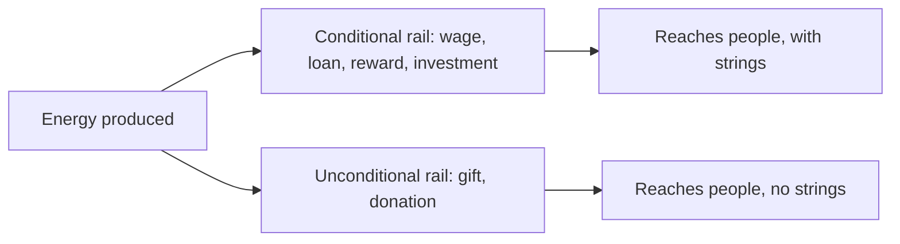

## How to read this article

This is part of a series on the economy that AI and robotics are building. Like the others, it is written for two readers at once.

- Sections marked **🟢 In plain words** are for everyone.
- Sections marked **🔧 Under the hood** are for the curious — real references, real code, no hand-waving. Skip them freely.

It builds on the flagship essay, [*You Tell It What to Do, and It Does It Until It's Done*](/thoughts/you-tell-it-what-to-do-and-it-does-it). You do not need to have read it, but the one idea to carry over is this: as machines do more of the work, fewer activities need a human — and that forces a question most people never ask, which is *what money actually is.*

## The one line

> **Money is not wealth. Money is energy — stored capacity to make things happen.** Once you see it that way, the economy of the AI age stops being scary and starts being obvious.

## Part 1 — What money actually is

### 🟢 In plain words

You do not want money. Nobody wants money. What you want is the things money can *do* — a meal, a home, a doctor, a day off, a gift for someone you love. Money is just the stored ability to make those things happen later. It is a battery. A dollar in your pocket is a small charge of *someone else's effort*, held in a form you can discharge whenever you choose.

That is the whole trick of money: it lets you save up the power to make things happen and spend it later, on anything, with anyone. It is potential energy for the human world. And like energy, the interesting question is never "how much exists" — it is *how it flows.*

### 🔧 Under the hood

This is not just a metaphor; it is close to literal at the edges. Money is a social technology — a transferable claim on future work and resources. And in at least one modern form the energy link is direct: [Bitcoin](https://bitcoin.org/bitcoin.pdf) secures its ledger through proof-of-work, which converts real electrical energy into monetary integrity. Energy in, money out. The lens we are using here — *money as stored capacity to make things happen* — is the frame that makes the rest of this series fall into place, because it turns "the economy" from a pile of numbers into a question of flows: where the energy comes from, and where it goes.

## Part 2 — Two ways energy moves

### 🟢 In plain words

Here is the part almost everyone blurs together. There are two fundamentally different ways energy moves between people, and they are not the same transaction at different sizes — they are different *physics.*

- **Conditional flow — energy with strings.** A wage, a loan, a reward, an investment. Value moves *because* something is expected back: work delivered, money returned, a stake repaid. Every conditional flow is a little contract. This is the economy of jobs.
- **Unconditional flow — energy with no strings.** A gift. A donation. Helping someone because you want to, with nothing owed in return. No contract, no repayment, no terms.

Both deliver energy to a human. But one demands a return and one does not — and that single difference decides everything about what kind of society they build.

### 🔧 Under the hood

The unconditional flow is not a utopian invention; it is older than markets and well-studied. The anthropology of the [gift economy](https://grokipedia.com/page/Gift_economy) — most famously Marcel Mauss's 1925 work on gift exchange — shows that giving has organized human societies for as long as there have been humans, through bonds and reciprocity rather than contracts ([overview](https://en.wikipedia.org/wiki/Gift_economy)). One honest nuance from that literature: a gift is rarely *purely* free — it tends to create a social bond, a soft obligation of relationship rather than a hard term of contract. That is the point, not a flaw. The conditional rail binds people with *contracts*; the unconditional rail binds them with *relationships.* A healthy society runs on both. What changes in the AI age is the *mix.*

## Part 3 — Jobs were an energy-routing hack

### 🟢 In plain words

For all of history there was really only one reliable way to route energy to a human being: make them do necessary work, and pay them for it. That is the *job* — not a law of nature, but a routing protocol. It worked, and it worked brilliantly, for one reason: human labor was scarce and necessary. If you wanted the work done, you needed the human, so paying the human was how the energy reached them. Work in, money out, life sustained. The loop closed.

The whole arrangement depended on that scarcity. Take it away — let machines do the necessary work, faster and cheaper and tirelessly — and the routing breaks. Not the *production* of energy; there is more of that than ever. What breaks is the *route.* The old wire from "a human did necessary labor" to "a human receives the means to live" carries less and less current, because less and less of the necessary labor runs through a human at all.

This is the real anxiety under "AI will take the jobs." It is not that the abundance stops. It is that the only rail most people have ever had for receiving their share of it is the one being automated away.

## Part 4 — The abundance flip

### 🟢 In plain words

So here is the flip, and it is the heart of the whole thing. In a world of *scarcity,* the conditional rail dominates by necessity — you must earn, because there is not enough and your labor is needed to make more. In a world of *abundance,* that logic inverts. The machines produce more than enough. The labor is no longer scarce. And the energy still has to reach people — they still need to eat, to live, to enjoy their one life — but it can no longer all travel down a rail that requires them to have done necessary work first.

So the unconditional rail has to grow. Giving — shared abundance, value that reaches people without a contract attached — stops being a charitable afterthought and becomes *primary infrastructure.* This is not the death of the conditional economy; people will still trade, build, invest, and be rewarded for the irreplaceable things only they can do. It is a shift in the *balance* — from a world where almost all energy reaches you with strings, toward one where more and more of it reaches you without them. That is the sustainable abundance economy in one sentence: **the machines make the abundance, and giving becomes the main way it gets to people.**

### 🔧 Under the hood

This is exactly why the economic layer underneath our products treats both rails as first-class — not one real payment type and one bolted-on "donate" button. In OrangeCat, fixed-price entities settle through `orders` and the `payment_intents` ledger: a `buyer` pays a `seller` for a specific thing, a conditional and contractual transfer. Contribution-pattern entities (causes, wishlists, research, and more) settle through a separate `contributions` table, where a transfer carries an optional `message` and an `is_anonymous` flag and expects *nothing* back — the unconditional case, modeled as its own primitive rather than a special kind of sale. The conditional economy (commerce, `investments`, `loans`) and the unconditional economy (giving) already sit side by side on the same rails. So as the balance shifts from the first toward the second, no new infrastructure is required — the system already knows the difference between a wage and a gift.

## Part 5 — What this is not

### 🟢 In plain words

A few honest guardrails, because big ideas attract lazy versions of themselves.

- **This is not "money disappears."** Energy still has to be accounted for and directed. Abundance is not infinity — it is *enough,* produced cheaply. Accounting matters more in abundance, not less, because the question shifts from "how do we make enough?" to "how do we route it well?"
- **This is not a claim that scarcity vanishes.** Scarcity *moves.* When the necessary labor is cheap, the scarce things become judgment, taste, trust, attention, care — and energy itself. A future piece in this series is about exactly that inversion.
- **This is not built in full yet.** The fully automatic version — work verified, value routed instantly down whichever rail fits — is the roadmap, not today's reality. Today a human still confirms the movement of money. The building blocks are in the ground; the autopilot is being built. We will keep saying which is which.

## In one breath

Money was never the point. It was always a proxy for something older and simpler: *I helped you; you help me; we keep each other alive.* For most of history we could only express that through scarcity and contracts — through jobs. As the machines take over the necessary work, the proxy can finally relax back toward the original. Strip away the coercion and what is left is the oldest human thing there is: giving.

**In scarcity, you earn your energy. In abundance, we give it.** That is the economy worth building — and the infrastructure for it is being written now.

This is one piece of a larger argument. More to come.
