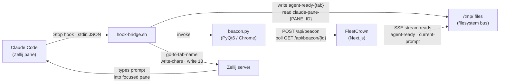
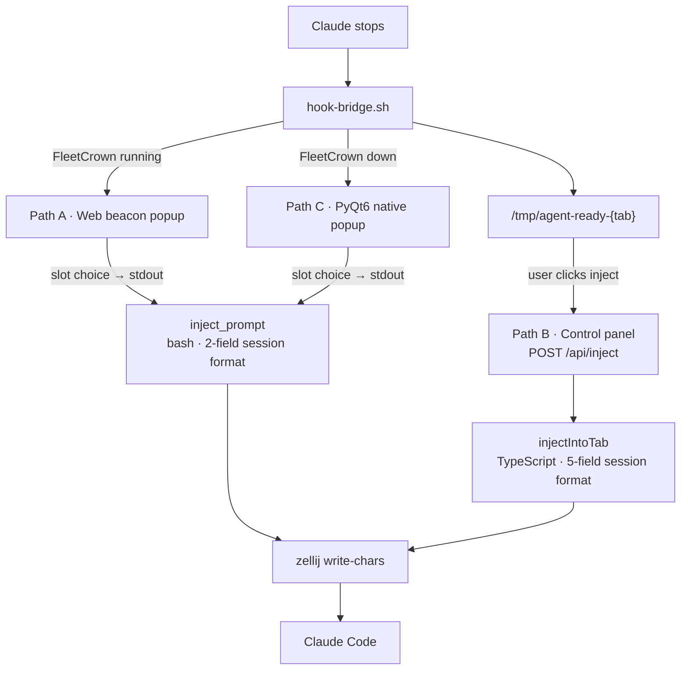

## The Setup

FleetCrown runs multiple Claude Code sessions simultaneously, one per project, each in its own Zellij tab. When Claude finishes a turn, a popup appears. The user picks the next action. Claude continues.

That description makes the system sound trivial. It is not.

Between "Claude finishes a turn" and "the popup appears" is a pipeline that crosses five process boundaries, involves two different programming languages, uses the filesystem as its message bus, and must correctly identify which of potentially many open terminal tabs the injection should target.

This post is the full forensic account: what the system does, where it fails, and why.

## Five Moving Parts That Must Stay in Sync

The system has five components. They run in separate processes, share no memory, and communicate exclusively through files on disk.

**Zellij** is the terminal multiplexer. It manages tabs and panes. It accepts commands relevant here: `go-to-tab-name` to switch to a named tab, and `write-chars` to type text into the focused pane. These are one-way fire-and-forget commands — they return no confirmation, and they do not block until the action completes.

**Claude Code** is the agent runtime. It runs inside a Zellij pane and fires hooks at lifecycle events. The relevant hook is `Stop`, which fires when Claude finishes a turn and returns control to the user. Claude passes its working directory and other context to the hook as JSON on stdin.

**agent-hook-bridge.sh** is the orchestration layer. It reads the hook payload, resolves the current Zellij tab by name, writes state files, and invokes the popup. This is 200 lines of bash.

**beacon.py** is the popup daemon. Written in Python with PyQt6, it renders either a native desktop window (the fallback path) or opens a frameless browser window pointed at the FleetCrown web app (the primary path).

**FleetCrown** is the Next.js web app. It serves the beacon popup page, the control panel, and the injection API. It maintains a server-sent event stream that pushes real-time state updates to the control panel every two seconds.

The filesystem is the message bus. The critical files are:

- `/tmp/agent-ready-{tab}` — a timestamp written when Claude finishes a turn, signaling "ready for input"
- `/tmp/agent-current-prompt-{tab}` — a JSON blob describing the prompt currently running
- `/tmp/agent-closing-{tab}` — written when the close-session flow is in flight
- `/tmp/agent-closed-{tab}` — written when the session has been cleanly terminated
- `/tmp/agent-stop-active-{tab}` — a lock file that tells the system a popup is already open
- `/tmp/claude-pane-{ZELLIJ_PANE_ID}` — maps a Zellij pane ID to its tab name
- `~/.claude/sessions/{tab}.md` — a structured summary written by Claude at the end of each turn

The ZELLIJ_PANE_ID environment variable is the key that makes all of this work. Zellij assigns each pane a stable integer ID. Claude inherits this from its environment. Every hook that fires inside that Claude session inherits it too. It is the thread that ties a process back to its tab.

## Three Injection Pathways

There are three distinct paths by which a prompt can reach Claude. That number is already a warning sign. When a system has three ways to accomplish the same thing, each will silently diverge from the others.

### Path A: The web beacon popup

This is the primary path when FleetCrown is running. When Claude stops:

The hook runs `resolve_tab` to convert the working directory into a Zellij tab name. If it succeeds, the ready sentinel is written. Then the hook calls `beacon.py stop` via command substitution — meaning the shell blocks, waiting for a choice to appear on stdout.

Inside `beacon.py`, the function `_web_stop` creates a beacon session by POSTing to `/api/beacon`. It opens a frameless Chrome or Brave window at `/beacon/{id}?countdown=12`. It then enters a polling loop, checking `GET /api/beacon/{id}` every 0.8 seconds for up to 120 seconds.

When the user clicks a button in the browser window, the page sends `PATCH /api/beacon/{id}` with the chosen slot number. The polling loop detects the choice, prints it to stdout, and exits.

Back in the hook, the command substitution captures the output. The hook looks up the full prompt text for that slot from `~/.config/agent-prompts.json`, builds the final prompt string, and calls `inject_prompt`: `zellij action go-to-tab-name`, sleep 0.3 seconds, `zellij action write-chars`, sleep 0.1 seconds, `zellij action write 13`.

### Path B: The FleetCrown control panel

The control panel at `/control` has inject buttons on every project card. When a user clicks one, the browser posts to `/api/inject` with the tab name and prompt key.

The TypeScript route resolves the live Zellij tab name by calling `getZellijTabs()` and `resolveEffectiveTab()`. It builds the prompt using `buildPromptWithSession()`, which wraps the base text with session context and appends the full five-field session update format. It then calls `injectIntoTab()`, which runs the same three Zellij commands via `execSync`.

### Path C: The PyQt6 native popup

When FleetCrown is not running, `_web_stop` starts it and waits 30 seconds. If FleetCrown never responds, `_pyqt_stop` shows a native Qt window synchronously. The user clicks. The choice is captured the same way as Path A and processed through the same injection code.

Three paths enter. Two different prompt formats exit. The divergence at the inject step is Bug Four.

## Bug One: Tab Resolution Fails Silently When It Matters Most

`resolve_tab` is the function in `agent-hook-lib.sh` that converts a working directory into a Zellij tab name. It is the most important function in the entire system and the most fragile.

It tries five methods in order. First: the `AGENT_TAB_NAME` environment variable, which is almost never set. Second: the pane identity file at `/tmp/claude-pane-{ZELLIJ_PANE_ID}`. Third: a legacy PID-keyed tab file. Fourth: process hierarchy scanning, reading `ZELLIJ_PANE_ID` from `/proc/{pid}/environ` for all children of the Zellij server, then correlating with working directories. Fifth: conf file directory matching — scan `~/.config/agent-projects.conf` and find entries where the configured directory matches the current working directory.

Method 2 is the right answer. The `claude()` bash wrapper writes the pane file at launch time, keyed by `ZELLIJ_PANE_ID`. Because the pane ID is stable and unique per session, this is unambiguous. The problem is that method 2 fails in several real situations: Claude was resumed via `--continue`, bypassing the wrapper; the user renamed the Zellij tab after Claude started; the pane file was cleaned up by a reboot or tmpfs flush.

When method 2 fails, execution reaches method 5. The conf file contains three entries that map to the same directory:

> FleetCrown|/home/g/dev/cockpit
> FleetCrown Claude|/home/g/dev/cockpit
> FleetCrown Openclaw|/home/g/dev/cockpit

Method 5 iterates the conf, counts how many entries match the current working directory and are also open in Zellij. When all three tabs are open, `exact_count = 3`. The resolution logic sets `TAB_NAME` only when `exact_count` is exactly 1. When it is 3, `TAB_NAME` stays empty.

The hook then reaches an early-exit guard:

> [ -z "${TAB_NAME:-}" ] && exit 0

It exits with code 0. No popup. No injection. No log message visible to the user. The failure is completely silent. The system appears to have simply ignored the stop event. In reality it could not identify the tab and gave up.

This is the root cause of the injection failures that have been reported most often. The system works perfectly when the pane file exists. When it does not and multiple tabs share a directory, method 5 produces an ambiguous count and the whole pipeline short-circuits silently.

## Bug Two: write-chars Has No Confirmation Mechanism

Once `resolve_tab` succeeds, injection still has a race condition built into its fundamental operation.

The injection sequence is: call `zellij action go-to-tab-name`, sleep 0.3 seconds, call `zellij action write-chars`, sleep 0.1 seconds, call `zellij action write 13`. This is identical in both the bash path and the TypeScript path.

The problem is that `go-to-tab-name` is a message to the Zellij server. It does not block until the tab is actually displayed. The 0.3 second sleep is a heuristic. Under load — FleetCrown recompiling, another Claude session active, the SSE stream polling — the tab switch can take longer. When `write-chars` fires before the switch completes, the text goes into whatever pane is currently focused.

If FleetCrown's own terminal is open in the same Zellij session, the prompt lands there instead. If the user had a shell window focused, the prompt types itself into the shell. From Claude's perspective, nothing happened. From the user's perspective, Claude received no input and appears to be doing nothing.

There is a second problem on top of the race. `write-chars` types into the focused pane of the target tab — not into Claude specifically. If the user has a multi-pane layout with Claude on the left and a shell on the right, and the shell was last focused, the prompt goes into the shell regardless of which tab is active.

Neither path has any mechanism to verify that the injection landed where it was intended. The commands fire, the sleeps pass, and the system assumes success.

## Bug Three: Concurrent Stop Hooks Create a Double-Injection Window

When Claude finishes a rapid sequence of small turns — tool calls that complete in under a second each — the stop hook can fire multiple times before the first popup has been answered.

There is a guard against this. The hook reads a lock file, checks its age, and exits if a recent lock exists. But the check and the write are not atomic. Between the moment the hook reads "no lock exists" and the moment it writes the lock file, a second hook can also read "no lock exists" and proceed. Both show popups. Both wait for user input. Both inject when they receive a choice. Claude gets two prompts in sequence.

The lock also has the wrong scope. It guards against a second popup opening. It does nothing about the case where the user clicks the inject button in the control panel while a beacon popup is already waiting. Paths A and B are completely uncoordinated.

If a user sees the "ready" indicator in the control panel and clicks inject while the web beacon popup is simultaneously open and polling, two injections will fire in close succession. Claude will receive both. It will execute the first and then immediately receive the second as if it were a new directive.

## Bug Four: The Prompt Claude Receives Differs by Injection Path

The most architecturally subtle bug is invisible to the user but shows up in the session files over time.

The bash injection path builds the session update instruction as: "Update the session file when done with what you completed and what remains." That produces two fields: `done:` and `next:`.

The TypeScript injection path (through `buildPromptWithSession`) appends a precise block instructing Claude to write five fields: `done:`, `next:`, `tests:`, `todos:`, and `health:`.

The session file format that FleetCrown depends on has five fields. The control panel displays all five. The SSE stream diffs on all five. When sessions are injected through Path A — which is the primary path — only two fields get written. On the next turn, the control panel renders the project as having no test count, no TODO count, and no health status. Not because Claude did not check those things. Because the prompt never told it to report them.

There is a further wrinkle. The prompts in `~/.config/agent-prompts.json` already contain the full five-field session update format embedded in the prompt text. When Path B injects, `buildPromptWithSession` appends the instruction a second time. Claude reads the same instruction twice. The redundancy is harmless to Claude but is a clear signal that the session format has drifted out of its single source of truth and into three separate locations: the prompts file, the TypeScript wrapper function, and the bash prompt-building code in `handle_stop`.

Three locations, two different subsets of the format. This is the kind of drift that accumulates invisibly and is extremely hard to debug from the output alone.

## Bug Five: The SSE Stream Resolves Tab Names Once at Connection Time

The control panel subscribes to a server-sent event stream at `/api/control/stream`. When the connection is established, the stream resolves each project's canonical tab name to its live Zellij casing using `getZellijTabs()` and `resolveEffectiveTab()`. These resolved names are used for all subsequent `/tmp` file reads for the entire lifetime of the stream connection.

If Zellij tabs change while the control panel is loaded — the user opens a new Claude session, renames a tab, or closes one — the stream continues reading `/tmp` files under the stale names. A ready sentinel written as `/tmp/agent-ready-FleetCrown-Claude` is invisible to a stream that is looking for `/tmp/agent-ready-FleetCrown`. The project appears frozen even though it has transitioned to a new state.

The stream reconnects on error, which re-resolves tab names. But that reconnection is driven by a network error, not by a Zellij topology change. The gap can persist for as long as the browser tab stays open without an error.

## What the Happy Path Looks Like

It is worth being precise about what the system looks like when all five components cooperate correctly.

The `claude()` bash wrapper is the key. When Claude is started through it, the wrapper reads the current Zellij tab name, writes the pane identity file keyed by `ZELLIJ_PANE_ID`, and writes a screen geometry file with the monitor coordinates. These two files are the foundation of everything else.

When Claude stops inside a session started this way: `resolve_tab` reads the pane file and gets the exact tab name in under a millisecond. The ready sentinel is written under that exact name. `beacon.py` checks `/api/health` (a fast, unconditional endpoint), finds FleetCrown running, creates the beacon session, and opens the browser window at the correct screen position. The user picks slot 1 in 12 seconds. The polling loop returns the choice. The prompt is injected. The session file gets all five fields.

Under these conditions, the loop is fast, reliable, and completely correct. The 30-plus commits of history on the injection system represent the incremental work of closing the failure cases that the happy path does not cover.

## The Structural Problem

The underlying structural problem is not any single bug. It is that the system has three injection paths that diverge after the popup choice is made, with no shared ownership of the logic that builds the final prompt and writes the state files.

The beacon popup and the control panel both let the user pick a prompt. But one injects from bash with a simplified two-field session format, the other injects from TypeScript with a different five-field format. The PyQt6 popup is a third variant that also uses the bash format. All three end up calling the same Zellij commands but with different prompt text.

There should be one injection path.

The correct architecture: when Claude stops, the hook writes the ready sentinel and exits. The user responds through one interface — the control panel — and one API route handles all injection. The web beacon popup becomes a toast or prominent card inside the control panel, not a separate browser window. The bash injection code and the TypeScript injection code collapse into a single implementation. The prompt-building logic lives in one function. The session update format is embedded in the prompt texts once, not appended again at build time.

This collapses three paths into one. It eliminates the prompt format divergence. It eliminates the double-injection race between popup and panel. It removes the dependency on `beacon.py`'s web-stop polling loop entirely, which removes the FleetCrown-availability check, the browser-positioning code, and the 120-second timeout.

The pane file approach for tab identity stays — it is the correct mechanism. The SSE stream stays but re-resolves tab names on each tick rather than once at connection time. The `write-chars` heuristic becomes a verified sequence: call `go-to-tab-name`, query the active tab, confirm it matches, then send characters.

## Why the Current Design Exists

None of the current complexity is accidental. Each layer was added to solve a real problem at a specific point in time.

The beacon popup as a separate browser window exists because the control panel is not always open when Claude stops. A popup that appears unconditionally — even when the user is working in another application — means no completion event is missed.

The bash injection path exists because the shell has direct access to the Zellij session environment and can inject reliably when tab identity is known. Running the injection from a web server process adds indirection and requires the web process to have socket access to Zellij.

The PyQt6 fallback exists because FleetCrown takes seconds to start after boot, and the popup needed to work immediately without waiting for Next.js to compile.

The pane file approach to tab identity exists because working directories alone are ambiguous. Multiple tabs can run the same project. Multiple projects can share a directory. Only the pane ID is unambiguous.

Each decision was correct for the context in which it was made. The bugs live at the seams: where bash meets TypeScript, where the popup meets the panel, where the primary path meets the fallback.

## The Broader Principle

This system is a concrete case study in what happens when you use the filesystem as an interprocess communication layer between components that were not designed together from the start.

The filesystem is a valid IPC mechanism. Files are durable, inspectable, and language-agnostic. A shell script, a Python daemon, and a TypeScript server can all read and write the same file. That is the right choice for this architecture. The problem is that filesystem-based IPC has no schema enforcement, no built-in atomicity guarantees beyond single-write POSIX semantics, and no concept of file ownership between concurrent writers.

When `handle_stop` reads the lock file and then writes it, another process can run between those two operations. When the SSE stream resolves tab names at connection time, there is no mechanism to invalidate that resolution when the Zellij session topology changes. When three injection paths build the prompt in slightly different ways, there is no compile-time enforcement that they agree.

These are not exotic edge cases. They are structural properties of the design. The fix is not to abandon filesystem IPC — the fix is to add the missing invariants: atomic lock operations, coordinated state ownership, and a single authoritative source for the prompt-building logic.

> The complexity is not in any one component. It is in the coordination between them.

Every multi-process system with shared mutable state eventually arrives at this point. The question is whether you discover the coordination gaps through analysis or through production incidents. In this case: both.
