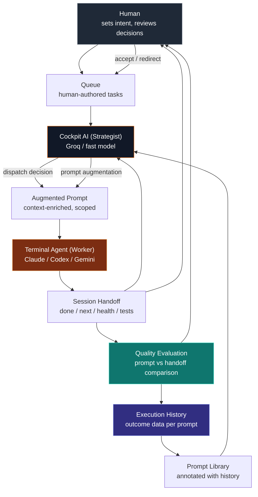

## Two Articles in One Problem

The dispatch intelligence problem is real, and it has been written about in this series already. The question that article addresses is: *which* prompt should the system send next — the next item in the queue, or the next-best-step AI recommendation? That is a routing problem, and the answer requires reading session state, handoff health, git delta, and goal context before choosing.

But there is a second problem underneath it that is never addressed: even after the system makes the correct dispatch decision, the prompt it sends might still fail. Not because the wrong prompt was chosen, but because the prompt itself — however carefully written — is a poor fit for what the agent actually needs at that moment.

That is the craft problem.

The dispatch problem asks: which prompt?
The craft problem asks: how do you write prompts that work, in sequence, over time?

Both problems need solving. This article is about the second one.

## The Way Most People Think About Prompts

Most people think of a prompt as a task specification. You have a thing you want done. You write it down clearly. The agent does it.

This model works for isolated, stateless tasks. "Write me a sorting function." "What does this error mean?" "Convert this CSV to JSON." Single-turn requests where the agent starts fresh, has no prior context, and needs only the information in the message.

Sequential agent work is nothing like this.

When an agent is doing real development work — working inside a codebase over multiple sessions, accumulating understanding of a project's structure, reasoning about tradeoffs between approaches, building incrementally toward a goal — the agent is not stateless. It has a working model. It has built up a representation of the project that includes: which files matter, which patterns recur, which approaches have been tried, what the style conventions are, what is currently broken, and what the implicit goal of the current work stream is.

That working model is fragile. It lives in the context window. It is rebuilt on every new conversation start. And — crucially — it is rebuilt differently depending on what the incoming prompt provides as scaffolding.

A prompt that ignores this working model erases it. The agent starts fresh, which means it may relearn things it had already figured out, may revisit decisions that were already made, may approach the problem from a completely different angle, and may produce work that is inconsistent with what came before.

A prompt that supports this working model compounds it. The agent has a richer foundation to reason from, produces output that is coherent with prior work, and moves the project forward instead of sideways.

The difference between a productive agent loop and a drifting one is whether your prompts compound or reset.

## What a Drifting Sequence Looks Like

A developer is building a payment integration. The first session goes well — the agent implements the Stripe webhook handler, writes route validation, wires the event types. The handoff says: done: implemented webhook handler and event routing, next: write integration tests, health: good.

The queue has these items queued from earlier in the day:
- "Refactor the user settings page to use the new form component"
- "Add logging to the payment routes"
- "Update the ENV docs in the README"

The system drains the queue. "Refactor the user settings page to use the new form component" fires.

The agent pivots. It starts reading the settings page code. It has no context about the payment integration it just finished. The new form component it is supposed to use was created three weeks ago and has its own conventions, which the agent rediscovers by reading the existing usages. This takes tokens. This takes time. The agent does the refactor, finishes, and the handoff says: done: refactored settings form, next: add validation feedback to the new form.

The queue drains: "Add logging to the payment routes" fires.

Now the agent has to context-switch back to the payment module. The webhook handler it wrote in the first session is now one level removed from its current working model. It reads the routes again, reconstructs its understanding, adds logging. The handoff says: done: added logging, next: clean up the log format.

Two sessions later, you have: a refactored settings form, logging in payment routes, and a webhook handler with zero integration tests. The original next step — write integration tests — was bypassed entirely. Not because the system forgot about it. Because the queue contained items that seemed reasonable when written but were not ordered for execution context.

The project has not moved forward. It has moved sideways across multiple concerns simultaneously, leaving each one in a partially-finished state. The work is technically done, but the compounding did not happen. Each session started from reduced context compared to the previous one. Each transition cost something.

This is not an exotic failure mode. It is the default mode for any system that treats prompts as independent units rather than as links in a continuous chain.

## What a Compounding Sequence Looks Like

Same developer, same payment integration. The first session is the same — webhook handler, event routing, handoff says next: write integration tests.

But this time, the system makes a different choice. It does not drain the queue. It runs next-best. The next session prompt is: "The auth module webhook handler and event routing were completed in the last session. The handoff flags that integration tests are needed and health is good. Continue: write integration tests covering the main webhook event types, following the existing test patterns in src/__tests__/."

The agent has scaffolding. It knows which module it is working in. It knows the task is a direct continuation. It knows where the existing tests live. It starts from the handoff's context, not from zero.

This session produces the integration tests. The handoff says: done: wrote integration tests for webhook events, tests: 8 passing, next: add idempotency handling for duplicate events, health: good.

The third session continues: "Previous session added integration tests for the Stripe webhook handler — 8 passing. The remaining gap is idempotency handling for duplicate events. Continue: implement idempotency using the event ID, ensure duplicate events are acknowledged without re-processing, add tests."

Three sessions in, the payment integration is complete and tested. The agent never had to rediscover the project structure. Each handoff gave the next session enough context to resume without backtracking. The queue items — settings form refactor, README update, log format cleanup — are still there. They have not been lost. They will run when it is appropriate to run them, which is after this work stream is finished.

The difference is not the quality of the individual prompts. It is the coherence of the sequence.

## The Anatomy of a Compounding Prompt

A prompt that compounds has specific structural properties that most ad-hoc prompts lack.

**It carries a context summary.** It does not assume the agent remembers the previous session, because it cannot — the agent starts fresh on every conversation. A compounding prompt provides a brief, accurate summary of the recent work: what was built, what was decided, what state the codebase is in. This is different from repeating the handoff verbatim. It means synthesizing the most relevant facts into a sentence or two that orients the agent before the task description begins.

**It names the exact concern.** A vague prompt like "continue working on the payment integration" leaves the agent to rediscover where to start. A specific prompt like "continue: implement idempotency handling for duplicate webhook events in src/webhooks/stripe.ts" tells the agent exactly which file, which function area, and which design decision is being addressed. The specificity is not limiting — it is orienting.

**It anchors to existing patterns.** Agents produce more consistent output when the prompt references existing conventions: "follow the pattern used in the auth module," "use the same error handling approach as the other webhook handlers," "maintain the test structure in src/__tests__/payments/." This is not hand-holding. It is preventing the agent from inventing new patterns when good ones already exist.

**It states what done looks like.** A compounding prompt ends with a clear, verifiable definition of success. Not a feeling of completeness, but a concrete criterion: "integration tests should cover the main event types and pass," "the duplicate event should be acknowledged without re-processing," "no new TypeScript errors should be introduced." The agent can self-evaluate against this. The handoff reflects whether the criterion was met.

**It respects the handoff health.** If the previous handoff said health was "needs attention," the compounding prompt addresses that before moving forward. It does not carry forward broken work and add to it. A compounding sequence is also a correcting sequence — each prompt in the chain either advances the work or stabilizes it before advancing.

## The Handoff as Report Card

The handoff — the structured summary that an agent produces at the end of a session — is the most underused signal in the current system.

It is treated as a display artifact. You can see it in the control panel. It tells you what happened. But the system does not evaluate it. It does not compare what the prompt asked for against what the handoff says was done. It does not flag divergence. It does not use the handoff to adjust the next prompt's scope or framing.

This is a missed opportunity of the first order.

The handoff is the agent's honest assessment of its own work. The `done` field says what it believes it completed. The `next` field says what it believes should happen next. The `health` field says whether it is confident in the state it has left things. The `tests` field says whether the code it touched is verifiable. The `todos` field says whether it ran out of time or scope.

Reading this honestly produces a report card on the previous prompt:

- Did `done` match what the prompt asked for? If not, the prompt was too broad, too vague, or asked for more than one session could hold.
- Does `next` match the expected continuation? If the prompt asked for feature A and the handoff says next is "fix the regression introduced in A," something went wrong that the prompt did not anticipate.
- Is `health` anything other than "good"? If so, the prompt's scope may have been miscalibrated — it may have pushed too far without including stabilization steps.
- Are there new todos? If so, the prompt may have underspecified the work, leading the agent to discover complications that were not in scope.

A system that reads this report card can do something valuable: it can adjust the next prompt before it fires. Not just choose whether to drain the queue or run next-best — but actually modify what gets sent, based on what the handoff reveals about the gap between what was asked and what was done.

This is prompt quality evaluation. It is different from dispatch selection. And it is where the embedded AI layer gets its most interesting work.

## What Cockpit's Embedded AI Actually Does

There is a distinction that matters and is often blurred: the AI that lives in the terminal is not the same as the AI that should live in Cockpit.

The terminal agent — Claude, Codex, Gemini, whichever model is running the session — is an executor. It takes a prompt, reads the codebase, writes code, runs tests, makes decisions. It is the worker. Its intelligence is applied to the task at hand.

Cockpit's embedded intelligence should be something different: a strategist. Not a worker that executes tasks, but a meta-layer that reasons about the sequence of tasks, the quality of the instructions, the state of the project, and what the next genuinely best move is.

The distinction is important because the strategist and the worker have fundamentally different information needs.

The worker needs: the current codebase, the current task, the relevant context for that task.

The strategist needs: the sequence of recent tasks, the handoffs from those tasks, the queue of upcoming tasks, the project's goals, the health trend across sessions, and the relationship between what was planned and what got done.

The worker operates within a session. The strategist operates across sessions.

The worker uses a large context window full of code. The strategist uses a small, structured input of metadata: handoffs, queue items, git delta, goal states, health history.

This means Cockpit's embedded model does not need to be a frontier model. A fast, cheap model — Llama-3.1-8b on Groq, which returns in under 300 milliseconds — is sufficient for the structured classification and generation tasks that strategic dispatch requires. The call is cheap. The decision is valuable.

```
Cockpit Embedded AI — Strategist
  Input: handoff, queue, git delta, goal state, health history
  Output: dispatch decision, prompt adjustment suggestion, health flag
  Latency: < 300ms (Groq)
  Cost: < $0.001 per dispatch decision

Terminal Agent — Worker
  Input: codebase, task prompt, relevant context
  Output: code changes, test results, handoff
  Latency: minutes
  Cost: varies by session length
```

The roles are complementary, not competitive. The strategist makes the worker more effective by giving it better scaffolded prompts. The worker makes the strategist more informed by producing honest handoffs. They operate in a loop — one in-session, one cross-session — that is more capable than either alone.

## The Four Things Cockpit's AI Can Do

Given this framing, the embedded strategist layer has four concrete responsibilities that go beyond simple dispatch selection.

**One: Dispatch selection.** The question already described in the dispatch intelligence article: queue item or next-best? Read the handoff, evaluate the queue, choose. This is the first and most urgent capability because it prevents the worst outcome — mechanical queue drain that undermines project momentum.

**Two: Prompt adjustment.** Before a selected prompt is injected, the strategist can augment it. If the prompt is a raw queue item — "add logging to the payment routes" — and the handoff indicates the payment module was just reworked, the strategist can prepend: "The payment module was reworked in the previous session. When adding logging, be aware that the event handlers were restructured — see src/webhooks/stripe.ts." This is a small addition that costs almost nothing. It makes the worker significantly more effective by ensuring it has the relevant context before starting.

**Three: Quality evaluation.** After each session, compare the previous prompt against the resulting handoff. Flag the mismatch if `done` does not match what was asked, if `health` degraded, or if new todos appeared that suggest scope exceeded capacity. The flag does not block — it informs. The human sees: "Last session's prompt may have been too broad. Health degraded. Suggest narrowing the scope on the next iteration." This closes the feedback loop that currently does not exist.

**Four: Sequence planning.** Given the current project state — goals, queue, recent handoffs, git delta — the strategist can suggest a prioritized sequence for the next three to five sessions. Not commands, but a plan: "After the current auth work is complete, the queue contains three unrelated items. Suggested order: 1) Add logging to payment routes (related to recent work), 2) Integration tests for the auth module (continues current concern), 3) Settings form refactor (independent — good separation)." The human accepts or modifies. The queue reorders. The next sessions are more coherent than they would have been with FIFO drain.

These four capabilities share a common shape: they take structured input (handoffs, queue, state), run a short LLM call, and return a decision or suggestion that makes the next session more effective. None of them require the large context windows or long outputs that terminal agents use. All of them can run on Groq's free tier.

## The Prompt Library as Training Ground

The prompt library — the system's collection of named, reusable prompt templates — already exists in Cockpit. It stores prompts that have been run before, lets the user browse and select them, and supports scheduling.

What it does not do yet is learn.

Every prompt in the library has a usage history: which projects it was run on, what the handoffs looked like afterward, whether health improved or degraded, whether the session produced the expected output. That history is the most valuable training data the system has for understanding which prompts work in which contexts.

A library that learns from this history can do something useful: it can annotate prompts with context signals. "This prompt tends to work well when health is good and the project is mid-feature. It tends to produce degraded health when run on projects with failing tests." A prompt tagged this way becomes a contextual tool, not a static template.

The strategist layer can use these annotations at dispatch time. Instead of choosing between a queue item and next-best, it chooses between a queue item, next-best, and a library prompt that has historically performed well in the current project state.

This is the beginning of Cockpit developing operational intelligence about the projects it manages. Not intelligence in the abstract — intelligence grounded in actual execution history, actual handoff records, actual outcome data. The kind of intelligence that a human operator develops over months of managing a project, but made explicit, transferable, and reviewable.

## What the Human's Job Becomes

If the system handles dispatch selection, prompt augmentation, quality evaluation, and sequence planning, what is left for the human?

Everything that requires judgment.

The strategic decisions that the AI cannot make: what the project should prioritize, whether a technical approach is correct for the long-term architecture, when to switch agents, when to stop and review rather than continue. The quality bar that only the owner of the product can set. The taste that determines whether "passing tests" is actually "good code."

The human's job in the ideal system is not to manage the queue. It is not to write careful prompts for every session. It is not to monitor handoffs and manually adjust direction. Those are mechanical jobs that compound badly under volume — the more projects you run, the more overwhelming the management burden becomes.

The human's job is to set direction and exercise judgment when judgment is required. To read the strategist's suggestions and accept, reject, or redirect them. To catch the cases where the system's reasoning is wrong. To define what success looks like for each project, which the system then works toward autonomously.

This is what the portable cockpit article describes as the walk test: you go for a walk. Your phone buzzes. The system says the current session finished — here is the handoff, here is the suggested next step, here is why. You read it. You say "continue" or "not that — do this instead." You put the phone down. The work continues.

The human is not removed from the loop. The human is in the loop at the right frequency, for the right decisions, with the right information — instead of being in the loop constantly, reactively, for every scheduling and sequencing decision that a capable system could handle.

## The Feedback Loop That Closes Everything

The thing that makes this system coherent — dispatch selection + prompt augmentation + quality evaluation + sequence planning — is that it is a loop, not a pipeline.



Every session generates a handoff. Every handoff feeds the quality evaluator. The quality evaluator feeds the execution history. The history informs the prompt library. The library informs the strategist. The strategist produces better dispatch decisions and better-augmented prompts for the next session. Better prompts produce better handoffs. The loop tightens over time.

This is a learning system. Not in the machine-learning sense of weights being updated, but in the practical sense: the system accumulates experience about what works in this project, with this agent, in this context, and uses that experience to make better decisions going forward. The human's judgment is preserved at every step — they can override any decision, redirect any sequence, add or remove queue items. But the burden of maintaining coherence across sessions shifts from the human to the system.

## Where Groq Fits (and Where Frontier Models Make Sense)

Groq provides the free, fast inference layer that makes the strategist practical. The dispatch call, the prompt augmentation call, the quality evaluation call — all of these are short-input, short-output classification or generation tasks. They do not require a frontier model. Llama-3.1-70b on Groq is capable enough and returns in under two seconds.

The free tier on Groq is generous: 14,400 requests per day, 30 requests per minute. For a system dispatching once per agent session, and running one quality evaluation per handoff, a single user running ten active projects simultaneously would consume roughly forty to eighty calls per day — well within free tier limits.

Frontier models make sense in two places:

**Sequence planning.** Generating a coherent five-session plan for a complex project — one that considers goal dependencies, technical debt, health trends, and the relationships between queue items — is a reasoning task that benefits from more capable models. Claude Haiku or GPT-4o-mini can do this for under a cent per plan, which is reasonable for a feature run on-demand.

**Prompt drafting for humans.** A future feature: the user describes what they want to accomplish in plain language, and Cockpit drafts the prompt — a specific, context-enriched, properly scoped instruction for the current project state. This is more creative and nuanced than classification, and benefits from a stronger model.

The bifurcation is practical: Groq for the real-time dispatch loop, frontier models for on-demand higher-quality planning. Free tier for the core. Optional paid tier for the premium capabilities.

For multi-user Cockpit — if and when it becomes a shared platform — each user's dispatch budget scales with their usage, and the model tier scales with their plan. A user who wants Cockpit's strategist to be their Claude Sonnet-powered co-founder gets a better service than a user on the free tier. The infrastructure for this is the same Groq / OpenAI-compatible routing layer; only the API key and model name change.

## The Implementation Path

The system described above should be built incrementally, in a sequence that delivers value at each step without requiring the full vision to be in place.

**Step 1 — Handoff quality flag (no AI required).** Before any AI call, teach the dispatch logic to read the current handoff's health field. If health is "critical" or if the tests field shows failures, suppress queue drain and send next-best regardless. This is a rule, not a model, but it prevents the most obvious failure mode — draining the queue into a project that is already broken. Ships in half a day.

**Step 2 — Groq dispatch call.** Wire `/api/control/dispatch` as a new route that calls Groq with a structured prompt: handoff + queue + git delta → QUEUE or NEXTBEST + reason. Test it independently with real handoffs. Confirm the decisions are sound. The frontend does not change yet — the route exists but is not called by autocontinue. Ships in a day.

**Step 3 — Wire dispatch into autocontinue.** Replace the current `shiftQueue() or sendIntent("next_best")` decision with a call to `/api/control/dispatch`. Show the reason in the ready banner — "Auth tests failing — continuing current thread. Queue item postponed." Ship behind a per-project toggle ("smart dispatch") so the user can opt in. Ships in a day.

**Step 4 — Prompt augmentation.** Before a selected prompt is injected — whether from the queue or from next-best — pass it through a Groq call that reads the current handoff and prepends the relevant context. The augmented prompt is what actually gets sent to the agent. The original prompt is stored for display, so the user sees what they wrote; the agent sees the enriched version. Ships in a day.

**Step 5 — Quality evaluation.** After each handoff is recorded, run a background evaluation call that compares the last prompt against the handoff output. Store the evaluation result — match/mismatch, scope assessment, health delta — in the execution history table. Show a "session quality" signal in the project card: green for good match, yellow for partial, red for significant divergence. Ships in two days.

**Step 6 — Library annotations.** Surface the execution history data in the prompt library: which prompts have consistently produced good outcomes, which have produced scope overruns, which work well in broken-health states versus good-health states. Let users mark prompts as "foundation" (good for starting a work stream), "continuation" (good for mid-stream), or "cleanup" (good for stabilization after complex sessions). Ships in a day.

**Step 7 — Sequence planning.** An on-demand "Plan next sessions" button that calls a stronger model with the full project context — goals, recent handoffs, queue, health history — and returns a suggested five-session sequence. The user reviews, accepts, modifies. The queue reorders. Ships in two days.

The total effort for steps one through seven is roughly eight to ten days of focused work. The result is a dispatch and prompting system that is meaningfully more capable than the current mechanical queue drain, delivers continuous value as each step ships, and builds toward the full learning loop without requiring any step to be in place before the previous one delivers.

## The Bigger Frame

There is a version of Cockpit that most people building AI tools will not reach because they are too close to the agent.

Most AI development tools — co-pilots, assistants, chat interfaces — optimize for the quality of the individual AI response. They make each turn better. They are good at this. They are not designed for the problem that appears when you have been running agents continuously for thirty days across eight projects: the problem of coherence over time, of momentum across sessions, of the compounding value of sequences that build on each other rather than starting over.

That problem is not an agent problem. It is a system design problem.

The agent cannot solve it because the agent is stateless across sessions. The agent cannot remember what it did yesterday, cannot compare its work against prior sessions, cannot evaluate whether its own output matched the prompt's intent. The agent is a powerful worker with no long-term memory.

The system around the agent can solve it. And that system — if it is built well — does not need to be the agent. It needs to be a persistent, accumulating, learning layer that tracks what was done, evaluates what was produced, and uses that history to make the next prompt better, the next dispatch decision smarter, the next session more coherent.

That is what Cockpit should be.

Not the agent. Not the terminal. Not the queue drain. The layer that makes all of them more capable over time, that carries the project's momentum across the gaps between sessions, and that allows a builder to step away from the machine — go for a walk, take a meeting, sleep — without that momentum collapsing.

The walk test is not just about remote access. It is about whether the system can be trusted to hold the thread when you are not watching it.

The dispatch and prompt craft work described in this article is how Cockpit earns that trust.
