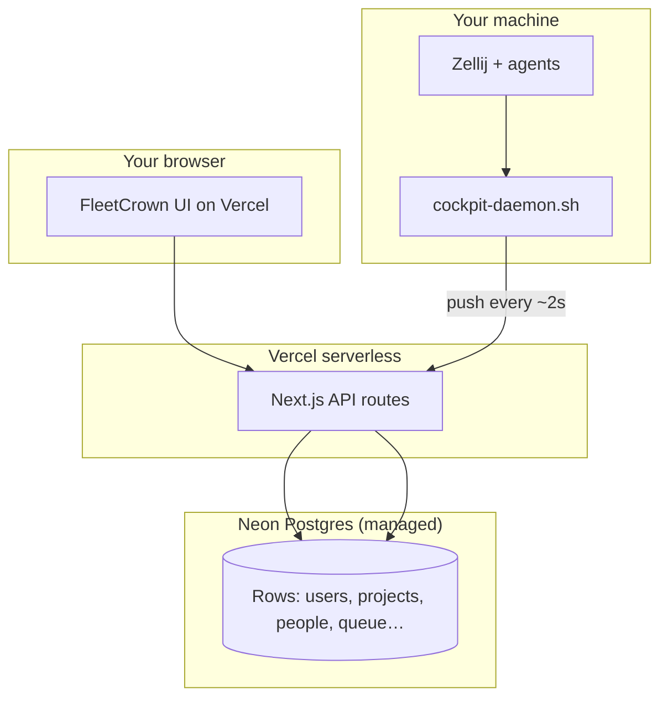

> **Historical (written 2026-05; outcome 2026-06-12).** Production Postgres has lived on Hetzner `bitbaum` since then. This essay is why we left Neon. It is not a setup guide. Do not create a Neon project. Do not put `neon.tech` in any `.env`. Live SSOT: `scripts/hetzner/apps.conf`.

## You Did Not Forget Your Password. The Database Got Turned Off.

One morning FleetCrown stopped letting anyone sign in. The Control page looked like a fresh install: no projects, daemon offline, onboarding banners everywhere. The natural reaction is to blame auth — wrong password, expired session, GitHub OAuth misconfigured.

None of that was the problem.

The error from Postgres, when you finally looked past the generic "incorrect email or password" message, was stranger:

> **Your project has exceeded the data transfer quota. Upgrade your plan to increase limits.**

Translation: **Neon turned the database off.** Not deleted. Not corrupted. *Suspended.* Like a landlord cutting power because you ran the dryer too often.

The app was fine. Vercel was fine. The code was fine. **The bytes leaving the database hit a free-tier ceiling** — and on Neon free, that ceiling has teeth.

This essay is what we learned fixing it, and how we think about database hosting when you are not building one CRUD app but a **control plane** that polls, pushes, streams, and never quite goes to sleep.

---

## A Quick Map of Where Data Lives

Before the jargon, picture the stack FleetCrown actually runs:



Three clients hammer one database:

1. **You**, clicking around the UI.
2. **Vercel**, spinning up serverless functions that each open a connection, run queries, return JSON.
3. **The daemon**, a small bash loop on your laptop that long-polls the cloud and **pushes runtime state every couple of seconds** so Control shows live Zellij tabs.

That third client is unusual. Most "Next.js + Postgres" tutorials assume your database sighs with relief at 3am. FleetCrown's database gets pinged like a group chat where someone never mutes notifications.

---

## Concept 1: Postgres Is a Server, Not a File

If you have only ever used SQLite or "database = file on disk," managed Postgres takes a minute to internalize.

**PostgreSQL is a program** listening on a port (usually 5432). Your app sends **SQL over the network**. The server returns **rows** — serialized as bytes — back over the network.

Every `SELECT * FROM people` is not "reading a file." It is:

1. TCP connection (maybe TLS handshake)
2. Query parsed and executed
3. **Result set streamed back to the client**

Those returned bytes are what vendors often call **egress** (data leaving *their* data center toward *your* app). Ingress is the trip in. Writes cost too, but for read-heavy dashboards **egress is the silent budget line**.

Neon free includes about **5 GB of public egress per month**. That sounds like a lot until you multiply:

| Traffic source | Rough math |
|----------------|------------|
| Daemon push every 2s | ~43,000 requests/day |
| Each request touches DB read/write | kilobytes add up |
| Control page polling / SSE | more reads |
| Local dev accidentally pointed at prod | you pay twice — once in life, once in egress |
| 1,300+ contact rows with JSONB | fat result sets |

We did not hit 5 GB because FleetCrown is badly written. We hit it because **the product shape is chatty** — and free tier pricing assumes you are not.

---

## Concept 2: Direct vs Pool — Two URLs, One Database

Another lesson that only bites in serverless: **how you connect matters**.

PostgreSQL has a limited number of concurrent connections. Vercel functions are **many short-lived processes**. If each one opens a raw connection to Postgres, you exhaust `max_connections` and get errors that look like random 500s.

The fix is a **pooler** — typically **PgBouncer** — sitting in front of Postgres:

```
Vercel function  ──►  pooler :6432  ──►  postgres :5432
                      (many clients, few server conns)
```

FleetCrown now uses two environment variables (vendor-neutral names):

| Variable | Use |
|----------|-----|
| `DATABASE_URL` | **Direct** connection — migrations, `LISTEN/NOTIFY`, DDL |
| `DATABASE_POOL_URL` | **Pooled** connection — normal app queries on Vercel |

Some features **cannot** go through a pooler. FleetCrown's Control SSE stream uses Postgres `LISTEN` for sub-second updates when the daemon pushes state. Poolers in transaction mode drop long-lived listeners. So you need **both** URLs in production.

Neon gives you a `-pooler` host automatically. Self-hosted Oracle/Hetzner setup means you run PgBouncer yourself — we packaged that in `infra/postgres-host/` for when we migrate.

**Takeaway:** "Just give me one connection string" works on localhost. Serverless production wants two.

---

## Concept 3: Managed vs Self-Hosted — Who Owns the Kill Switch?

| | **Managed** (Neon, Supabase, RDS…) | **Self-hosted** (Oracle VM, Hetzner VPS) |
|--|-------------------------------------|------------------------------------------|
| You operate | Connection strings | OS patches, Postgres backups, PgBouncer, firewall |
| Vendor operates | Postgres version, uptime, quotas | Power and disk (hopefully) |
| Billing | Usage meters — egress, CU-hours, storage | Fixed monthly (or $0 Oracle Always Free) |
| Kill switch | **Quota exceeded → suspend** | **You forget backups → regret** |

Managed is renting an apartment with utilities included until you blast the AC. Self-hosted is owning a small house — nobody cuts your power for bandwidth, but the roof is yours.

FleetCrown's outage was a **managed kill switch**: zero bytes malicious, just economics.

---

## What Actually Happened to Us (Timeline)

Worth documenting because it explains why production felt like a "new account."

1. **Production** lived on Neon project `ep-bold-shape-…` (EU).
2. **Local dev** was also pointed at that same Neon URL — the opposite of "local Docker for dev, cloud for prod."
3. **Daemon** ran 24/7 with `COCKPIT_DAEMON_FORCE_REMOTE=1`, pushing to Vercel → Neon constantly.
4. **Egress quota** exhausted. Neon suspended compute. Sign-in failed. Control empty.
5. **Emergency fix:** new Neon project `bitbaum-pg` (fresh quota), schema pushed, Vercel env updated, redeploy.
6. **Empty account:** new database has no rows. GitHub sign-in creates a user; zero projects. Correct behavior for an empty DB — infuriating for a human.
7. **Restore:** copied data from **local** Postgres (which still had 20 projects and 1,300 people) into production with `scripts/db/sync-user-data.sh`.

The old Neon project still holds whatever was only in prod at freeze time — **still unreachable** until quota resets or we pay. Local dev had been a accidental backup. Not a strategy. A rescue.

---

## The Studio Sprawl Problem

FleetCrown is one repo in a folder of many. A scan of `~/dev` showed the pattern:

- **Six+ apps** on various Neon endpoints
- **Two+ Supabase projects** (orangecat, printcraft — auth, storage, RLS)
- Some apps sharing one Neon host; some alone
- Each `.env.local` a snowflake

That is not a platform. That is **twelve free trials wearing a trench coat**.

The bitbaum README says "shared infrastructure, many products." The infra stack said "one Neon signup per side project." Those two sentences were fighting each other.

**Rule we are adopting:** one Postgres **trunk** (one VM or one paid org strategy), **many databases** (`cockpit`, `kivvi`, `revampit`, …). Vercel stays per-app. Supabase stays where the product *is* Supabase.

---

## Option A: Neon Free — The Free Tier That Fired Us

**Pros**

- Sign up in minutes, no credit card
- Branching, serverless scale-to-zero, pretty dashboard
- Perfect for a **hackathon CRUD app** or a schema you touch twice a week

**Cons (for FleetCrown)**

- **5 GB egress** then **hard suspend** — not throttle, *off*
- Chatty apps burn quota silently until auth breaks
- Easy to accidentally aim local dev at prod
- Multiple projects ≠ multiple free lunches if org egress is shared

**Verdict:** Neon free is **not a production home for FleetCrown**. It can be a **temporary bridge** (what `bitbaum-pg` is today) or a **preview database** for branches. Not the trunk.

---

## Option B: Neon Launch (~$5/mo and up)

**Pros**

- Same DX, no ops, 100 GB egress on paid tiers
- Fixes the immediate "turned off" problem with money
- Drizzle, Auth.js, Vercel — unchanged

**Cons**

- Usage-based bill grows with daemon traffic and project count
- **Per-app Neon** across a studio multiplies cost and complexity
- Still two URLs, still metered egress beyond allowance

**Verdict:** Reasonable for **one flagship SaaS** with bursty traffic. Poor fit for **a solo founder + twelve repos + always-on daemon**. You are paying rent on every sapling instead of one yard.

---

## Option C: Supabase — Keep It Where the Product Is Supabase

Orangecat is not "Postgres with extra steps." It is **Postgres + Auth + RLS + Storage + Realtime** as one product. Moving orangecat to a raw VM Postgres would be a **rewrite**, not a migration.

**Pros**

- BaaS features integrated; RLS in the database layer
- Free tier generous for **full-stack** use (with idle pause caveats)

**Cons**

- Paying for a bundle when you only need Postgres (FleetCrown uses Auth.js — wrong fit)
- Same egress class of limits on free
- Two active free projects per org

**Verdict:** **Stay on Supabase for Supabase apps.** Do not force FleetCrown onto it just to consolidate bills.

---

## Option D: Oracle Always Free — The Controversial $0 Datacenter

Oracle's Always Free tier is the internet's favorite punchline and secret weapon: up to **4 ARM cores, 24 GB RAM, 200 GB disk**, absurd **egress** compared to Neon free.

**Pros**

- **$0** with real hardware specs
- One VM runs Postgres + PgBouncer for **many databases**
- Egress cliff essentially gone for studio-scale traffic
- Matches "I run a product studio, not one startup" economics

**Cons**

- **Signup and capacity** — "Out of host capacity in Frankfurt" is a meme for a reason
- **You are the DBA** — backups, upgrades, TLS, firewall
- ARM — fine for Node/Postgres; occasional binary annoyance
- Oracle support is "community forum and vibes"

**Verdict:** **Best $0 trunk** for FleetCrown + sibling Drizzle apps if you can provision the VM. We packaged `infra/postgres-host/` and `scripts/db/deploy-host.sh` for this path.

---

## Option E: Hetzner — What Levelsio Pays €7 For

Pieter Levels does not use Oracle free because he hates money. He uses Hetzner because **€7/month buys boring reliability** — instant provisioning, EU datacenter, predictable invoice, no quota suspend at 5 GB.

**Pros**

- **CX32 ~€7/mo** — run dozens of small app databases on one box
- 20 TB traffic included — daemon can be daemon
- Simple mental model: one bill, one SSH key, one backup cron

**Cons**

- Not free
- Still self-hosted Postgres (same ops as Oracle, easier signup)

**Verdict:** **Best paid trunk** for a multi-project studio. Upgrade path from Oracle without architectural change — `pg_dump`, new URL, redeploy.

---

## Side-by-Side (FleetCrown-Shaped)

| | Neon free | Neon paid | Oracle free | Hetzner ~€7 |
|--|-----------|-----------|-------------|-------------|
| **Monthly cost** | $0 | $5+ | $0 | ~€7 |
| **Survives daemon 24/7** | ❌ | ✅ | ✅ | ✅ |
| **Survives dev mistake** | ❌ | ⚠️ | ✅ | ✅ |
| **Ops burden** | None | None | Medium | Medium |
| **Studio (10 DBs)** | Fragile | Expensive | ✅ one VM | ✅ one VM |
| **Kill switch** | Quota | Bill | You forget backups | You forget backups |

---

## Our Recommendation (May 2026)

**Short term:** `bitbaum-pg` keeps production alive while we migrate — not a destination.

**Medium term (free):** **Oracle Always Free VM** → Postgres 17 + PgBouncer → one database per project → Vercel env points at VM.

**When revenue or stress appears:** Same layout on **Hetzner CX32**. No Neon Scale per app. No five VPSes.

**Permanent exceptions:** **Supabase** for orangecat / printcraft. **Local Docker** for every `.env.local`. **Never** prod URL on the laptop.

**Neon free verdict for FleetCrown:** *workable as a lab; unworkable as production.* The product is a **life OS + fleet command center**, not a todo app you open twice a week.

---

## What We Built So Switching Is Boring

The goal is: **host change = env vars + dump/restore**, not a rewrite.

Already in the repo:

- `src/lib/db-url.ts` — vendor-neutral pool vs direct URLs
- `docs/infrastructure/postgres-portability.md` — cutover checklist
- `scripts/db/dump.sh` / `restore.sh` — portable backups
- `scripts/db/sync-user-data.sh` — user-scoped row copy between hosts
- `infra/postgres-host/` — Docker Compose for Postgres + PgBouncer on any VM

Switching from Neon → Oracle → Hetzner should feel like changing landlords, not rebuilding the house.

---

## Rules We Are Actually Going to Follow

Because the best infrastructure essay is useless if `.env.local` still points at prod on Tuesday.

1. **Local dev uses local Postgres only.** Docker Compose on `localhost:5432`. Full stop.
2. **Production uses two URLs** — direct + pool — on Vercel.
3. **One trunk, many databases** — not one Neon project per hack.
4. **Daemon off** when not testing Control — or accept you are paying (in quota or €) for always-on.
5. **Supabase stays Supabase** — don't migrate BaaS apps to raw Postgres without a design doc and a long holiday.
6. **Backups before heroics** — `npm run db:dump` before any cutover. Local dev accidentally saved us once. That is not a backup strategy.

---

## The Deeper Lesson (Why This Is Interesting)

Serverless changed **where code runs** — functions appear, handle a request, vanish. It did not change **where truth lives**. Truth still lives in Postgres rows: your projects, your people, your queue, your session handoff metadata.

Managed Postgres vendors price along axes that assume:

- Moderate read/write volume
- Connections that behave like a small pool of app servers
- Humans who do not aim their dev laptop at production

FleetCrown violates all three. It is a **control plane** — closer to observability or ops tooling than to a marketing site. The database sees traffic patterns like a **monitoring agent**, not like a blog.

That mismatch is the real story. Neon free did not "fail." **We picked a pricing model that assumes a different species of app.**

Once you see that, the fix is obvious: either **pay for managed** at the tier that matches chatty traffic, or **own the metal** (Oracle/Hetzner) and stop negotiating with egress meters.

---

## Closing: The Walk Test Applies to Data Too

We wrote elsewhere about the **Walk Test** — FleetCrown must work from your phone while the daemon keeps running at home. That test fails if the cloud database is suspended because you moved five gigabytes of rows.

Infrastructure is not separate from product. **The kill switch on the database is a kill switch on the walk.**

We are moving the trunk to infrastructure we control — first Oracle free, then Hetzner when €7 is cheaper than anxiety. Neon free stays in the toolbox for experiments, not for the fleet.

If you are building something quiet, Neon free is lovely. If you are building something that ** listens for NOTIFY and pushes state every two seconds**, buy the house — or take Oracle's weird free one — and sleep through the night.

---

*Follow-up to [Groq, Neon, and the Next Infrastructure Layer](/thoughts/groq-neon-and-the-next-infra-layer) — written when Neon was "already provisioned, just wire Vercel." We wired it. Then it turned us off. This is the corrected chapter.*
