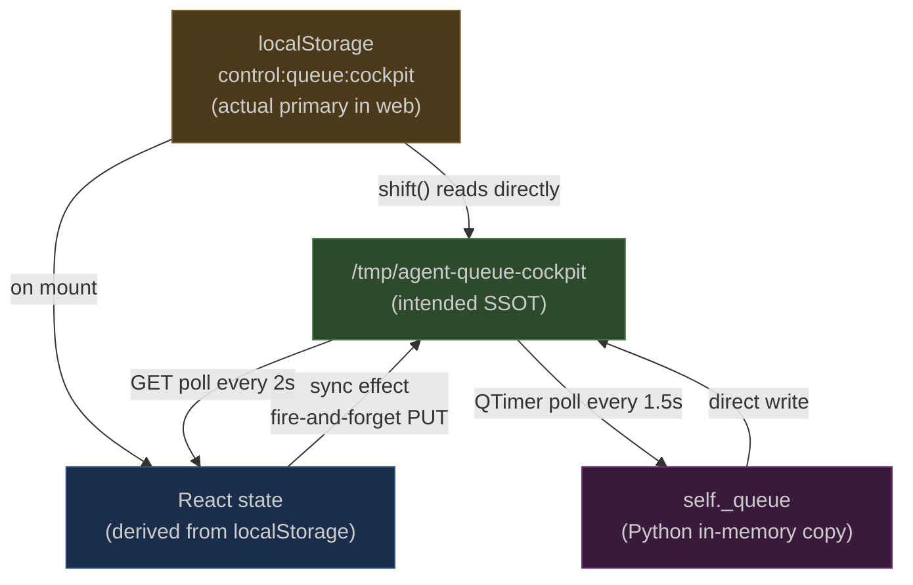
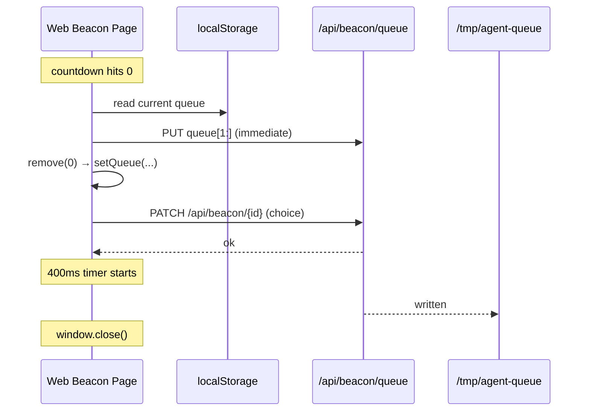
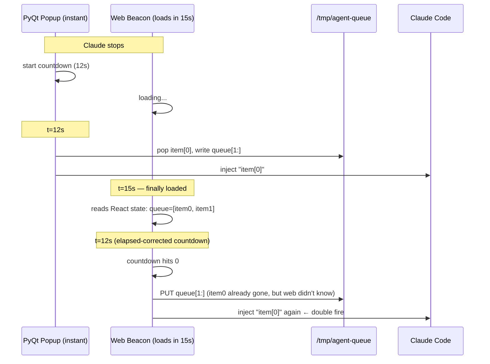
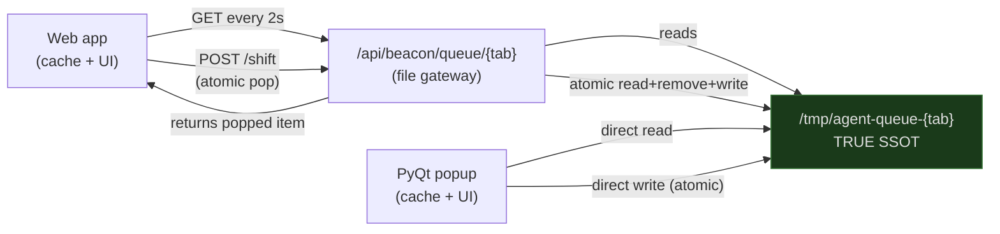

## The Promise

The queue is supposed to be simple. You type a prompt. It goes into a list. When Claude finishes its current turn, the list drains — one item per stop, in order, without you having to watch or click anything.

That is the product promise: a personal task backlog that runs itself.

What the implementation actually does is more complicated. The queue does not live in one place. It lives in four places simultaneously, with different processes holding different copies, syncing at different intervals, with no coordination protocol that prevents two consumers from popping the same item at the same time.

This post is a full forensic account of the queue system: how every part works, where coordination fails, and what a reliable version looks like from first principles.

## The Four Queue Owners

Every item in your queue exists in four simultaneous representations:

**The file** at `/tmp/agent-queue-{tab}` is the cross-process bridge. It is the only thing both the Python popup and the TypeScript web app can read. It is what survives a browser refresh. It is supposed to be the truth.

**localStorage** at `control:queue:{tab}` is the web app's local state. It is what React reads without making a network request. It is updated when you add or remove items. It is also read synchronously by the `shift()` function when the auto-fire logic needs the current queue without waiting for a re-render.

**React state** is derived from localStorage on mount and updated by every queue mutation and every poll cycle. It is what the queue list component actually renders.

**PyQt's `self._queue`** is an in-memory Python list inside the native popup. It is loaded from the file on startup and refreshed every 1.5 seconds by a `QTimer`.

Four copies of the same data. The system treats the file as the source of truth in principle. In practice, it treats localStorage as the source of truth in execution — because `shift()` reads it synchronously, and the file is only written as a side effect of state changes, not as the primary write target.



The arrows tell the story. There is no single path. There is no single writer. There is no protocol that says "this write wins if there is a conflict."

## How the Queue Flows

### Adding an Item

When you type a prompt in the web UI and press Alt+Enter:

```
enqueue(text)
  → setQueue([...current, text])
  → localStorage updated
  → sync effect fires after render
    → fetch PUT /api/beacon/queue/{tab}
      → /tmp/agent-queue-{tab} written
```

When you add from the PyQt popup:

```
self._queue.append(text)
self._save_queue()
  → /tmp/agent-queue-{tab} written directly
```

Both paths write to the file. The PyQt write is synchronous and immediate. The web write is asynchronous and deferred — it happens after the React render cycle completes, which is after the current JavaScript execution context finishes.

### Removing an Item

This is where the system had its worst bug.

When the beacon countdown hits zero, the auto-fire logic calls `remove(0)`. Until recently, `remove` only called `setQueue(q => q.filter(...))`. That schedules a React state update. The state update triggers a re-render. The re-render triggers the sync effect. The sync effect fires a `fetch PUT`. All of that has to complete before the page closes — which happens 400 milliseconds after the PATCH to the beacon API resolves.

The window closed before the file was updated. The item stayed in the file. The next beacon popup opened, saw the item, and fired it again. That is why the same prompt kept appearing in Claude's context three times in a row.

The fix was to call `syncQueueToFile` directly inside `remove`, reading the current state from localStorage synchronously, before the React render cycle. The PUT fetch starts immediately, giving it the full 400ms window to complete.



The immediate PUT starts alongside the PATCH, not after it. Both complete before the window closes.

### The Shift Operation

The control panel's auto-inject uses `shift()` instead of `remove()`. The difference matters.

`shift()` reads localStorage synchronously, removes the first item, writes back to localStorage, calls `setQueue`, and calls `syncQueueToFile` — all in one function, synchronously, without waiting for a render cycle. It was designed specifically because `setQueue`'s functional updater runs during the render phase and returns `null` at the call site, making it impossible to read the popped item from the state update itself.

`shift()` is the correct model for the whole system. It reads the current truth, mutates it, and writes back immediately. The `remove()` function now does the same thing.

## Three Auto-Fire Implementations

The rule is simple: when the countdown reaches zero, pop the first queue item and inject it. If the queue is empty, inject the primary slot.

That rule is implemented in three separate places.

**The PyQt popup** (`_beacon_popups.py`):
```python
def _tick(self):
    self._secs -= 1
    if self._secs <= 0:
        self._timer.stop()
        if self._queue:
            item = self._queue.pop(0)
            self._save_queue()
            self._choose(f"custom:{item}")
        else:
            self._choose("1")
```

**The web beacon page** (`page.tsx`):
```typescript
useEffect(() => {
    if (countdown !== 0 || autoFiredRef.current) return;
    autoFiredRef.current = true;
    const choice = queue.length > 0
      ? `custom:${queue[0]}`
      : String(primary?.slot ?? "1");
    if (queue.length > 0) remove(0);
    submitRef.current(choice);
}, [countdown, ...]);
```

**The control panel** (`ProjectCard.tsx`):
```typescript
const handleAutoInject = async () => {
    const queued = shiftQueue();
    if (queued) {
        await onInject(project.tab, undefined, queued);
    } else {
        await sendIntent("next_best");
    }
};
```

Three implementations of one logical rule. When the rule changes — say, "skip empty string items" or "apply a different prefix format" — all three need to be updated. They will drift. They have already drifted: the PyQt version fires primary slot `"1"`, the web beacon fires `primary?.slot ?? "1"`, the control panel calls `sendIntent("next_best")` which goes through the orchestration layer. These are subtly different behaviors.

## The Double-Fire Risk

The most dangerous coordination gap: two consumers can fire the same queue item.

Here is the sequence:

1. Claude stops. The PyQt popup appears immediately (zero load time).
2. Simultaneously, `_web_stop` starts FleetCrown, creates a beacon session, opens Brave.
3. Both popups start counting down. PyQt is fast — it may be at 8 seconds by the time the web beacon loads.
4. PyQt countdown hits zero. PyQt pops `queue[0]`, writes the file, fires the item.
5. The file now has `queue[1:]`.
6. The web beacon has not yet polled the file (up to 2s delay). Its React state still shows `queue[0]`.
7. The web beacon's countdown also hits zero. It fires `queue[0]` again.

Claude receives the same prompt twice. The second injection interrupts whatever Claude started doing after the first.



The elapsed-correction on the web beacon's countdown makes this window large. The beacon starts its countdown at `AUTO_INJECT_S - elapsed_since_readyAt`. If PyQt fired at t=12 and the web beacon loaded at t=15, the web beacon starts at `12 - 15 = -3`, immediately fires, and sends the same item.

## The Auto-Continue Desync

The PyQt popup always opens with `auto_continue = True`. This is intentional — the popup is a fresh one-shot event, and auto-continue should be on.

But the web app has a persistent pause state in localStorage at `control:auto-continue:{tab}`. If the user paused in the web app 20 seconds ago, that state is still `"off"` when the next popup opens. The web beacon reads it and starts paused. PyQt does not read it and starts counting down.

Two popups. Two different behaviors. The user paused because they needed a moment to think. PyQt ignores that entirely.

The inverse is also true: if the user unpauses in the web beacon (clicking the play button), PyQt does not know. It stays paused.

## The Countdown Drift

The web beacon initializes its countdown from the `readyAt` timestamp: it subtracts the elapsed seconds since Claude stopped from `AUTO_INJECT_S`. If Claude stopped 4 seconds ago and `AUTO_INJECT_S` is 12, the beacon starts at 8. This is correct — it shows the user how many seconds are actually left, not how many were originally allocated.

PyQt starts from `COUNTDOWN_SECONDS` from the settings file. It does not know when Claude stopped. If the settings say 12, PyQt always starts at 12, even if 8 seconds have already passed.

When both are open simultaneously, the user sees two countdowns showing different numbers. The PyQt popup might say "12s" while the web beacon says "8s." One of them is wrong.

## What Is Actually Broken vs. What Works

To be fair, the system does work correctly on the happy path:

- Items are added to the queue in the control panel and appear in the beacon popup within 2 seconds.
- Items added in the PyQt popup appear in the web app within 2 seconds.
- Manual sends (clicking the arrow button) are immediate and reliable.
- The `fromPollRef` guard prevents the echo-back loop where web reads its own write.
- The `lastWriteRef` cooldown prevents unnecessary polling immediately after a write.
- Reorder and edit propagate correctly.

What breaks:

- **Repeated injection** — the race between page close and file write. Now fixed.
- **Double-fire** — two popups consuming the same item. Not yet fixed.
- **Auto-continue desync** — PyQt ignores pause state set in the web app. Not yet fixed.
- **Countdown drift** — PyQt and web show different numbers. Not yet fixed.

## The Structural Problem

The system behaves as if the file is the source of truth. It is not. The source of truth is whichever copy was written to most recently — and there is no coordination mechanism to determine that.

The correct model is simpler:

> The file is the queue. Everything else is a view.

Reads come from the file. Writes go to the file. Local state (React, PyQt in-memory) is a cache that is always downstream of the file, never authoritative over it. When a consumer wants to pop an item, it does not pop from its local copy and hope the file catches up — it pops from the file atomically, then updates its local view.



The key change: introducing a `/shift` endpoint that performs the read-remove-write cycle atomically on the server, eliminating the window where two consumers can both read the same first item.

## What Needs to Change

**1. Atomic shift API.** A `POST /api/beacon/queue/{tab}/shift` route that reads the file, removes the first item, writes back, and returns the item — all within a single synchronous Node.js function call. File I/O in Node.js is single-threaded. There is no race condition within one process. Multiple writers are serialized by the event loop. This eliminates the double-fire risk.

**2. Auto-continue state via file.** Write `/tmp/agent-auto-continue-{tab}` when the user toggles pause. Both the web app and PyQt read this on open and poll it for changes. When the user pauses in the web app, PyQt knows within 1.5 seconds.

**3. Countdown origin via file.** Write `/tmp/agent-ready-at-{tab}` (this already exists as the ready sentinel timestamp). PyQt reads it on startup and initializes its countdown to `COUNTDOWN_SECONDS - elapsed`. Both popups count down from the same origin.

**4. Single auto-fire implementation.** Move the "queue item or primary slot" logic into the `usePromptQueue` hook as a `consumeNext()` function. The web beacon calls it. The control panel calls it. PyQt, being Python, has its own implementation — but at least the web side is deduplicated.

**5. File as primary on mount.** When the web app mounts, read the file first, not localStorage. Use localStorage as a write-back cache, not as a primary source. This also fixes the reboot case where `/tmp` is cleared but localStorage persists with stale items.

## The Broader Principle

Every bug in this system has the same root cause: there are multiple sources of truth that are only eventually consistent, with no coordination protocol for conflicts.

The filesystem is a correct choice for cross-process communication between Python, bash, and TypeScript. Files are language-agnostic, durable, and inspectable. The problem is not using files — it is treating them as a sync target rather than as the primary store.

When you have five components that share state through files, the file wins every coordination question. Not "the file plus a localStorage mirror that gets polled back." The file. Reads come from the file. Writes go to the file. Local state is populated from the file on mount and updated on each poll. The file is the only thing whose word is final.

The current system is 80% of the way there. The polling, the sync effects, the atomic write with `.tmp` rename — all of that is correct. The remaining 20% is making the file the *primary* rather than the *backup*: flipping the authority from localStorage to the file on mount, making consume atomic via an API endpoint, and syncing the two pieces of state (auto-continue, countdown origin) that currently exist only in one world.

When that flip happens, the queue becomes what it was always supposed to be: a single list that any consumer can read, any consumer can modify, and only one consumer can pop from at a time. The product promise — a backlog that runs itself — holds.
