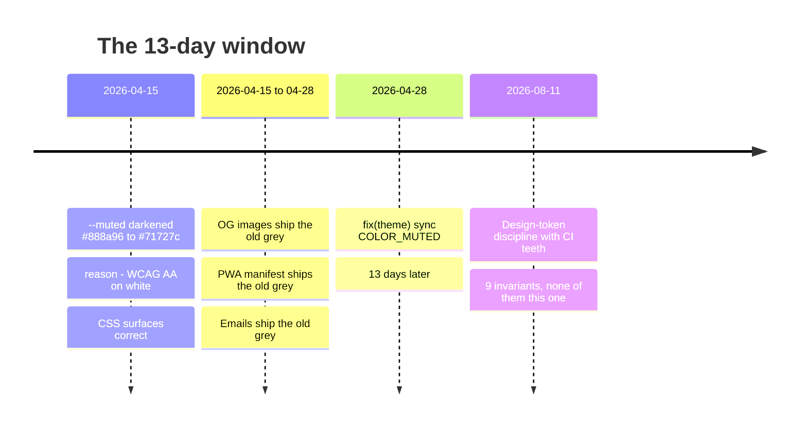
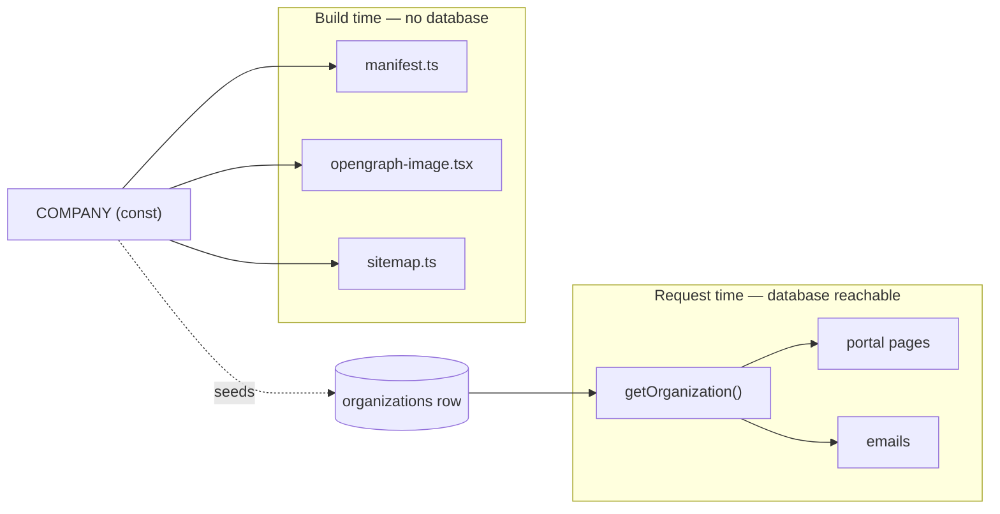

## The setup

Vita is a metabolic psychiatry portal — patients, clinicians, bookings, lab results, secure threads. Around 30,000 lines of application TypeScript, 88 test files, 1,321 tests. Nothing about it is casual.

Its design system is better than most. Every visual decision lives as a CSS custom property in one file, and the repo does not merely *ask* you to respect that. It fails the build if you don't:

| Invariant | Fails CI when |
|---|---|
| No raw colour in CSS modules | any `#hex`, `rgb()`, `hsl()` outside a `var()` fallback |
| Radii are tokens | a `border-radius` that isn't `var(--radius-*)` or `0` |
| Transitions are tokens | any literal duration on a `transition` |
| No hex in TSX | a hex literal in a className or style |
| `style={{}}` is allowlisted | inline style outside ten data-driven files |
| Allowlist is fresh | a listed file no longer has a style prop |
| Vars resolve, from modules | a `var(--x)` no `globals.css` defines |
| Vars resolve, within globals | same check, inside the token file itself |
| Media queries come last | an `@media` block preceding a base rule it overrides |

Nine assertions in `design-discipline.test.ts` plus `css-order.test.ts`. That last one guards a bug nothing else catches: a mobile `@media` block that loses to a later base rule of equal specificity. The admin stylesheet's entire mobile layout was once dead that way. No linter flags it. The page simply renders desktop on a phone.

The docblock states the ambition plainly: *make drift impossible instead of aspirational.*

## The rule with no test

One file sits outside all of it.

`lib/config/theme.ts` exports the palette a second time, as TypeScript hex constants. Its header says why, and then says the dangerous part:

> These constants exist for contexts that cannot use CSS variables (e.g. PWA manifest, OG images). **If a color changes, update both here and the corresponding var in globals.css.**

That is a comment where a test should be. And the repo *knows* it — `AGENTS.md` lists, among the violations to fix on sight:

> Hex values in `lib/config/theme.ts` diverging from `globals.css` → sync them

So the situation is: nine rules with CI teeth, and one rule that the repo documents as a violation, warns about in the file itself, and enforces with prose.

Guess which one broke.

## Git says it already broke



On 15 April someone darkened `--muted` from `#888a96` to `#71727c` for one reason: the lighter grey failed WCAG AA on white. It is an accessibility fix. The comment in `globals.css` still explains it.

`theme.ts` kept the old value until 28 April.

Look at what that means. `theme.ts` exists *precisely* for the three surfaces that cannot read a CSS variable — the OG image, the PWA manifest, the email templates. For thirteen days, the contrast fix reached every surface that could already read the token, and none of the surfaces that needed a literal. The accessibility repair skipped exactly the places it was needed, and the mechanism that was supposed to carry it there was a sentence in a comment.

Nobody noticed. There was nothing to notice with.

And then the interesting part: the enforcement layer arrived on 11 August, three and a half months after the incident, and covered nine other things.

That is the pattern worth naming. The team was not careless — they built more CI discipline around CSS than almost anyone ships. They simply automated the rules that were easy to express and left the one that had already cost them.

## Why we then duplicated on purpose

The next change wanted the same shape.

Vita's "who are we" — clinic name, address, the term for a patient's doctor before one is assigned — lived in `COMPANY`, a TypeScript `const`. Of 24 tables in the schema, none described the practice. The clinic was a literal you would have to fork, not a value you could vary.

That codebase had already learned this lesson twice, one level down. From `company.ts` itself:

> There is deliberately no `clinicianName` here. Naming one doctor in config made every email tell every patient the same name, which stopped being true the moment the clinic had two.

The same sentence is one word away from being about the clinic instead of the doctor.

So we added an `organizations` table and seeded it. But we did not delete the constant, and that decision is the whole point:



A clinic whose name exists only in a row cannot render its own favicon. The manifest, the OG image and the sitemap are produced at build time, where no database is reachable. Some duplication is not laziness — it is a boundary in the deployment model showing through into the code.

So we chose the same arrangement that had already rotted once: two expressions of one fact.

The difference is that this time we wrote the test.

## The guard

The obvious implementation compares the constant to the row. It cannot run: CI has no live database. `DATABASE_URL` is set in the workflow only so module imports don't throw, and the schema tests are explicit that they need no database — relation integrity is checked by *building* queries, never executing them.

So the guard reads the seed out of the migration SQL and compares it to the constant. It parses a file. No database, no network, ~40 lines. Fifteen assertions: one per seeded field, one that the field set matches exactly, one that the insert is idempotent.

That last one matters because the deploy replays migrations on every push.

## Prove it by mutation, not by passing

A green test proves nothing about a test. It proves the code passes *something*.

So we broke the seed on purpose and confirmed the failure:

| Mutation | Expected | Result |
|---|---|---|
| Seed email changed to `changed@example.com` | `email agrees` fails | ✅ failed |
| `ON CONFLICT` clause deleted | `is idempotent` fails | ⚠️ **`no tests`** |

The second one is the reason this article exists.

## The gate that reported silence

Deleting `ON CONFLICT` did not fail the idempotency assertion. It produced this:

```
Tests  no tests
```

The parser located the `INSERT` with a regex that terminated on `ON CONFLICT`. Remove the clause and the statement no longer matched, `seededValues()` threw during collection, and the file produced zero tests instead of one failure.

CI would have gone red, so nothing would have shipped. But consider what a developer sees. A named assertion failure says *the idempotency guard is gone*. A collection error says *something is wrong with your test file* — and the natural response to a test file that won't load is to look at the test file, not at the migration it was trying to defend.

**A gate whose breakage looks like silence is not a gate.** It had been keyed to the very clause it was testing. The fix was to terminate on the statement's own semicolon and keep the `ON CONFLICT` check as a separate, independent assertion. Re-run:

```
× is idempotent — apply-schema.sh replays migrations on every deploy
  Tests  1 failed | 14 passed (15)
```

That is a gate.

There was a second, quieter lie in the same file. The first parser read `'8008'` — the Zürich postcode — and returned the number `8008`, because it stripped the quotes and then guessed at the type. The test caught it as a mismatch against the string in the constant. Had the seed used a postcode with a leading zero, which is most of Europe, that guess would have silently deleted a digit. Quotedness in SQL is not decoration; it is the only thing distinguishing a postcode from an integer.

Both bugs were in the safety mechanism, not in the code it guarded. That is where they usually are, because nothing guards the guard.

## What generalises

Three things, in order of how often I see them missed.

**A duplicate you chose is fine. A duplicate you forgot is a bug.** The distinction is not architectural taste — it is entirely whether a test knows about it. `theme.ts` and `organizations` are the same design decision. One of them shipped a contrast-failing colour for thirteen days and the other cannot, and the delta is forty lines of parsing.

**Prove the gate by mutation.** Every rule you claim to enforce should be broken once, deliberately, and observed to fail — with the failure message read, not just the exit code. A test that has never failed is a hypothesis.

**Check that failure is loud.** The mutation is not finished when CI goes red. It is finished when the output *names the thing that broke*. Collection errors, skipped suites and empty result sets are all technically red, and all of them point the reader at the wrong file.

The last one has a corollary worth keeping. When you find a rule your codebase documents but does not test, the question to ask is not "should we test this?" It is "has this already broken, and would we know?" Git usually answers both. It took one `git log -S` to find thirteen days of the wrong grey — and that search cost less than the meeting where you would have debated whether the test was worth writing.
