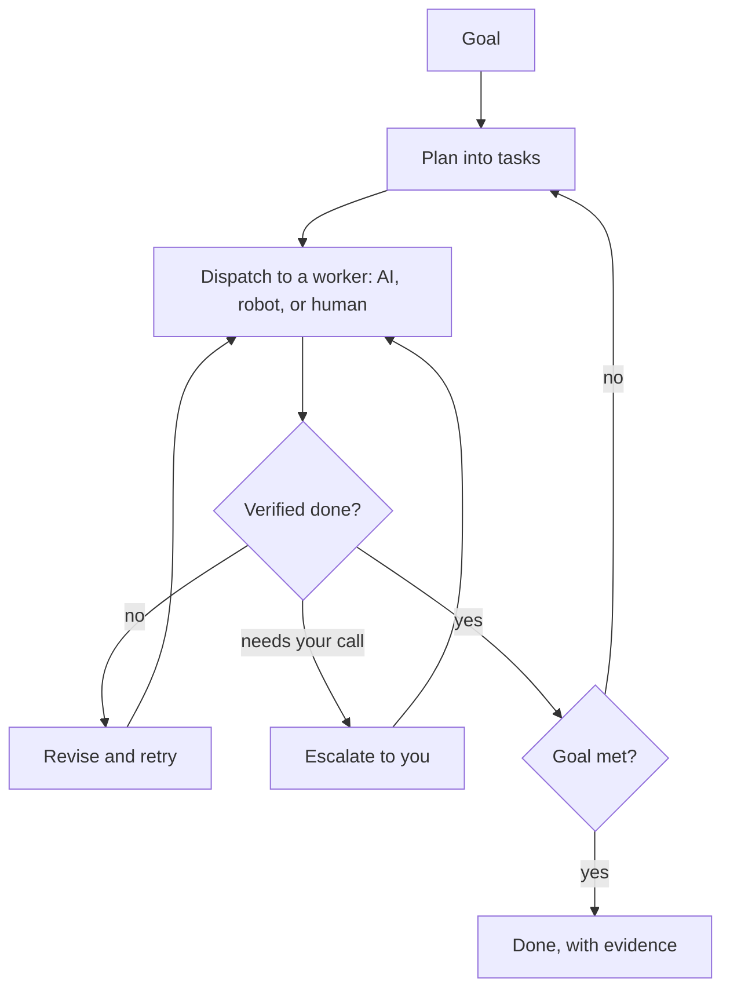
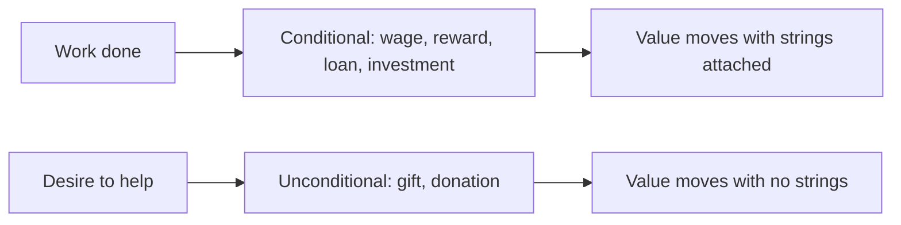

## How to read this article

This piece is written for two people at once: your non-technical friend, and your most skeptical engineer. You can read only the plain-language sections and understand the whole thing.

- Sections marked **🟢 In plain words** are for everyone.
- Sections marked **🔧 Under the hood** are for the technically curious — they explain *mechanically* how the magic is not magic, with references to real code and to authoritative sources. Skip them freely; you will not lose the thread.

Nothing here requires you to take anything on faith. The promise sounds like science fiction. The point of this article is to show you it is just engineering — and to be honest about which parts already run in production today versus which parts are the road ahead.

## The one sentence

> **You tell it what you want. It does it. It keeps going until it is actually done — coordinating AI, machines, and (as few as possible) people to get there — and it checks in with you for the decisions that are genuinely yours to make.**

That is the whole product. Everything below is just *how*.

Or, put another way: **most AI companies built something you talk to. We built something that gets things done — and keeps going when you walk away.**

## Part 1 — The big idea

### 🟢 In plain words

Today, software waits for you. You click, it responds. You type, it answers. The moment you stop, it stops. Every tool you have ever used is a tool you have to *operate*.

What we are building is different in one specific way: **it does not stop when you stop.** You give it an outcome — "ship this feature," "find me a drug candidate that hits this target," "keep the house running," "build the pool" — and it pursues that outcome the way a good employee would. It breaks the goal into steps. It does the steps. It checks its own work. When it hits something only you can decide — spend this money? approve this design? — it asks. Otherwise it keeps moving. When the goal is met, it tells you it is done and shows you the proof.

There are really only **two kinds of goals**, and understanding the difference explains almost everything:

- **Goals that finish.** Build the pool. Ship the feature. Find the candidate molecule. These have an end state. "Done" is a deliverable you can point at.
- **Goals that never finish.** Keep the house running. Keep an elderly parent safe and cared for. Keep the factory line at 99.5% uptime. These do not have an end — "done" means *a state is being maintained*, and the system only interrupts you when something falls outside the lines you drew.

The first kind is a project. The second kind is a subscription. We do both, with the same engine.

### Why this is not a magic button

The honest version of this pitch is not "press a button and your wish comes true." It is closer to this: **you hire an extremely capable, tireless operations manager who never forgets anything, works in parallel on a hundred fronts, and refuses to pretend something is finished when it is not.** A great manager does not do every task personally. They decompose, delegate, verify, and escalate. That is exactly what this is — except the workforce can be software, robots, humans, or all three at once.

## Part 2 — Why this is possible now (and was not three years ago)

### 🟢 In plain words

Three things had to become true at the same time. They just did.

1. **Machines can now understand a vague human goal and turn it into a plan.** Modern AI can take "migrate our app off the old framework" and produce an actual ordered list of steps — and revise the plan when reality pushes back. This is the part that used to be impossible.
2. **Machines can now use tools, not just talk.** The same models can run programs, call services, control other machines, and read the results back. They do not just *describe* the work; they *do* the work and see what happened.
3. **The cost of trying, checking, and trying again collapsed.** Doing a task, verifying it, and retrying when it fails used to require a human in the loop every cycle. Now the loop can run thousands of times unattended, cheaply.

Put those together and you get something that can *pursue a goal* instead of *answer a question*.

### 🔧 Under the hood

The unlock is the **agentic loop**: a model that interleaves reasoning with tool-calls, observes the result, and adjusts — the pattern formalized as [ReAct (Yao et al., 2022)](https://arxiv.org/abs/2210.03629). The economic unlock is that an iteration — plan step, act, observe, critique, revise — now costs cents and seconds, so it can run autonomously to convergence rather than gating every iteration on human attention. The architectural insight of this product is that *the loop itself* — not any single model — is the durable asset. Models are swappable components inside a stable orchestration, verification, and governance harness.

## Part 3 — How it actually works

This is the core of the article. We build it up one layer at a time. Each layer gets a plain explanation and a technical one — and where it matters, the technical one points at the actual code that runs today.

### The engine: a loop that refuses to quit

**🟢 In plain words**

At the center is a simple cycle that repeats over and over:

1. **Understand the goal** — turn what you said into a concrete plan.
2. **Break it down** — split the plan into tasks small enough to actually do.
3. **Do the tasks** — hand each one to the right worker (an AI, a robot, a person).
4. **Check the work** — did the task actually succeed? Prove it.
5. **Decide what is next** — adjust the plan based on what really happened.
6. **Escalate if needed** — hit a decision that is yours? Stop and ask.
7. **Repeat** until the goal is met — then show you the finished result and the evidence.

That is it. That loop, run relentlessly, is what makes "until it is done" real. The intelligence is in step 4 (honest checking) and step 6 (knowing what is yours to decide). Anyone can do steps 1 through 3. Doing 4 and 6 *well* is the entire ballgame.

**🔧 Under the hood**

In FleetCrown this is a real pipeline, not a metaphor. An intent enters through the `/api/inject` route. If a local runtime is present, it is typed straight into a live session; if not, it is written to a `pending_commands` queue and a desktop **Fleet Runner** claims it by long-polling `/api/control/commands`, using Postgres [`SELECT ... FOR UPDATE SKIP LOCKED`](https://www.postgresql.org/docs/current/sql-select.html) so two runners never grab the same job. Every dispatch carries a `runId`; the local orchestration library (`home/`) tails a single append-only event log (`~/.fleetcrown/events.jsonl`) through `watcher.ts` (emits `worker.idle` when a session changes), `worker.ts` (acts on `bridge.dispatch` / `bridge.cancel`), and a pure `decide.ts` brain. The append-only log is the single source of truth, which is what makes crash-recovery and idempotent replay possible: on reboot the worker rebuilds which `runId`s already started and refuses to double-fire.

### Layer 1 — The brain (and why it is swappable)

**🟢 In plain words**

The "brain" is the AI model that does the thinking — the planning, the judgment, the reading of results. Here is the important part: **we do not lock you into one brain.** You can put whichever model you trust in the driver's seat, and swap it later as better ones arrive. Different jobs can even use different brains — a cheap, fast one for routine steps, a powerful one for hard reasoning.

Why does this matter? Because the brain is the part of this field that changes fastest. Tying your whole system to one model is like building a car you can never change the engine in. We build the car. You choose the engine.

**🔧 Under the hood**

Model-agnosticism is concrete in the code, not a slogan. FleetCrown ships a fixed set of adapters — `claude`, `codex`, `gemini`, `openclaw`, `grok` — and every project carries an `agentPref` (which adapter) and a `modelPref` (which model), overridable per dispatch. What makes this work is a *universal handoff format*: whatever the brain, it reports back the same shape — `done`, `next`, `tests`, `health`, `status` — parsed out of the session by `parseHandoff()`. Because the contract is uniform, the orchestrator does not care which model produced the result. This is a deliberate inversion of the usual stack: most products are a thin wrapper *around* a model; here the model is a *component inside* the product. The moat is everything the model is not — the task graph, the verification signals, the governance policies, the memory, the worker integrations — and all of it benefits from every model upgrade for free.

### Layer 2 — The workers, and the goal of as few humans as possible

**🟢 In plain words**

A "worker" is whatever actually performs a task. The breakthrough idea is that the engine **does not care what kind of worker it is.** To the engine, a worker is just "something I can hand a task to, that comes back with a result I can check." That worker might be an **AI session** writing code, a **robot** moving a box or running a lab experiment, or a **human** — an architect approving a blueprint, a specialist the AI cannot replace, a contractor pouring concrete.

Now the part people get wrong. The goal is **not** to keep humans busy. The goal is to need **as few humans in the loop as possible.** Every human step is the slowest, most expensive, least scalable part of any process — it is the bottleneck by definition. So the engine is built to shrink the human share of every goal. And here is the trajectory that matters: as AI gets smarter and robots get more capable, that share *keeps shrinking.* Work that needs a person today will not need one in two years. The direction is one-way.

But — and this is the honest part — it never reaches zero for real-world goals. Someone has to approve the irreversible decisions. Someone has to do the physical work machines cannot yet do. Someone has to carry the judgment and the accountability that a business or a family will not hand to a machine. Those humans are real, they are essential, and **they have to be paid.** A future where machines do everything and people get nothing is not a future anyone should build. The whole point is the opposite: fewer people doing the irreplaceable parts, each one *rewarded* for it. That is why the economy underneath this matters as much as the engine on top — it is the subject of Part 6, and Part 7 follows the trajectory all the way to its surprising conclusion: the end of jobs themselves.

**🔧 Under the hood**

Every worker — silicon, mechanical, or human — sits behind the same interface: accept a task with inputs and acceptance criteria, report progress, return a result or a failure. AI workers are model sessions with tools. Robotic workers are machines behind their control APIs or a robotics middleware layer such as [ROS](https://www.ros.org/). Human workers are reached through human-in-the-loop task queues — a person is notified, does the thing, attaches evidence. ["Human-in-the-loop"](https://grokipedia.com/page/Human-in-the-loop) is a well-defined design stance, not a hand-wave: the system is explicit about *where* a human is required and treats every such point as a cost to drive down over time. Because the interface is uniform, the planner can route a subtask to whichever worker class is cheapest, safest, or fastest — and re-route to a human only when the machines cannot deliver — without the rest of the plan changing.

### Layer 3 — Knowing what "done" means (the hard part)

**🟢 In plain words**

Here is the question that separates a real product from a demo: **who decides it is actually finished, and finished *correctly*?**

It is easy to build something that *says* it is done. The danger is not a machine that fails loudly — it is a machine that confidently does the wrong thing for three days and reports success. So the goal is to turn every objective into **a definition of done that can be checked** — ideally checked by something other than the worker that did the work. For software: the tests pass, the feature works, nothing else broke. For the pool: it holds water, passes inspection, matches the design. For a drug candidate: it binds the target in a real experiment, not just on paper.

If "done" cannot be defined and checked, the engine will not pretend. That honesty is a feature, not a limitation.

**🔧 Under the hood**

Today FleetCrown reads completion from the worker's structured handoff — `status: ready`, a `tests: N pass · M fail` line, a `health` flag — and records the outcome of every run (`success`, `partial`, `error`, `hang`, `user_abort`, `timeout`) in `orchestration_runs`. That is real, and it is enough to drive the autonomy loop. But let us be precise about the frontier: a *fully independent* verifier — a second model or sensor, prompted to disprove success rather than confirm it — is the direction, not a finished feature. This is the single hardest thing to build in the whole system, and it is the real moat: anyone can wrap a model to *do* the work, but almost no one can independently *prove* the work was done right. The research it draws on is concrete: self-reflection that turns failures into corrective context ([Reflexion, Shinn et al., 2023](https://arxiv.org/abs/2303.11366)), and sampling multiple independent attempts to take a majority verdict ([Self-Consistency, Wang et al., 2022](https://arxiv.org/abs/2203.11171)). The principle stands: the more irreversible the action, the stronger and more independent the proof required before it commits.

### Layer 4 — Memory (so it never starts cold)

**🟢 In plain words**

A good operations manager remembers — what you decided last week, how your house works, which contractor flaked, what "done" looked like last time. The engine keeps a durable memory so it gets better at *your* goals over time and never makes you re-explain things. Continuous goals especially depend on this — you cannot "keep the house running" if you forget the house every morning.

**🔧 Under the hood**

State is persisted as the single source of truth across the loop. The `home/` library projects current project state from the append-only event log; the cloud side keeps `orchestration_runs`, `orchestration_events`, `project_states`, and a full audit trail in `control_audit_events`. Sessions can die and resume from this state without losing work — the same `runId` correlates a dispatched intent with its eventual outcome. Memory is also what enables the learning loop: the brain's confidence is computed from the last several run outcomes, so a project that has been failing gets more caution and a project that has been succeeding gets more autonomy.

### Layer 5 — Governance (this is the actual product)

**🟢 In plain words**

Now the most important part, and the part people underestimate.

The scary version of this technology is "an autonomous thing that spends my money and touches my life without asking." Nobody sane wants that. So the real product is not the autonomy — **it is the control.** You set the rules in plain terms — *never spend more than $500 without asking me*, *escalate any physical action before it starts*, *never touch production without a clean test run* — covering how much it can spend before asking, what it must never do without you, and what it may decide on its own. The engine operates *inside those lines*, and the instant a task would cross one, it stops and brings the decision to you. You can watch everything it is doing, in one place. You can pause it. You can see exactly why it did what it did.

Think of it as the difference between a self-driving car with no steering wheel and one where you are the captain — you see everything, you set the boundaries, and you take the wheel for the turns that matter. **We are building the captain's chair, not the runaway car.**

**🔧 Under the hood**

This is the most built-out part of the system, because it is the point. Before any auto-dispatch, a set of gates runs: if `health` is critical, if tests are failing, if blockers are pending, if the session is mid-work, if a no-op fuse has tripped, or if the project's mode is off — the dispatch is suppressed. Autonomy itself is graded: modes `manual`, `confirm`, `auto`, and `sleep` map to rising confidence thresholds (auto needs moderate confidence; sleep needs high confidence *plus* a clean health signal), and `confirm` never fires without a human releasing a countdown. Every decision and its reason is written to `control_audit_events`. Crucially, these checks live *outside* the model — the policy gate sits between intent and action, so the brain cannot talk its way past it. That is the structural difference between "we asked the AI to be careful" and "the AI physically cannot cross this line."

## Part 4 — What this looks like in the real world

Each example below is ordered from *safest and possible today* to *most ambitious*. For each: what you say, what happens, and the technical reality.

### Software projects — real today

**🟢 You say:** "Migrate our app off the old framework, keep everything working, ship it."

**What happens:** The engine maps the codebase, breaks the migration into hundreds of small changes, makes them, runs the tests after each one, fixes what breaks, and only merges what is proven green. It works through the night. In the morning you review a finished, tested result — and a log of every decision.

**🔧 Under the hood:** This is the most mature use case because the verification is cheap, automated, and trustworthy — and failure is fully reversible. Each unit runs in isolation (separate branches/worktrees), gated by the test suite and type-checker as the acceptance signal; failures feed back as retry context; a human approves the final merge. This is also exactly the loop FleetCrown runs on itself — intent in via `/api/inject`, a model adapter does the work, the handoff reports `tests` and `status`, the outcome lands in `orchestration_runs`.

### Scientific discovery — credible soon, bounded

**🟢 You say:** "Find me a molecule that binds this cancer target, and validate it."

**What happens:** The engine reviews the literature, proposes candidate molecules, *runs real experiments in an automated lab*, reads the results, learns, and iterates — narrowing toward candidates that actually work in a real experiment, not just in theory. It hands biologists the validated hits and the full experimental record.

> **Important honesty:** this is *not* "cure cancer with a button." It is "compress the slow, expensive search for a validated candidate from years to months." The cure still needs trials, scientists, and time — but the engine can run the tireless search underneath, and that alone is enormous.

**🔧 Under the hood:** The brain is a research-tuned model; the workers include in-silico tools (docking, property prediction, generative chemistry) *and* physical lab robots via cloud-lab APIs. The loop is a closed design-make-test-analyze cycle. "Done" means empirical activity confirmed in a real assay — independent, physical verification, not a model's say-so. Human scientists hold the governance gates: what to synthesize, safety, ethics.

### Industrial and B2B operations — where the money is

**🟢 You say:** "Keep our fulfillment center balanced," or "Run our quarterly compliance evidence collection," or "Handle tier-1 support; escalate anything you are not sure about."

**What happens:** These are *continuous* goals. The engine maintains a target state — throughput, compliance, response times — doing the routine work automatically and surfacing only the exceptions that need a human. It is the tireless operations layer a business always wished it had.

**🔧 Under the hood:** Event-driven steady-state loops monitoring KPIs and telemetry, with the policy gates defining intervention thresholds and escalation rules, and the audit trail (`control_audit_events`) making every action reviewable. That audit trail is what makes this pass enterprise security and compliance review — and it is why **B2B is the priority market**: higher value per customer, real budgets to replace manual operations, and a buyer who needs exactly the governance and audit layer that is the hardest thing to build, and therefore the moat. B2B is more revenue, not less work — the effort moves from *acquiring users* to *earning trust at the boundary*, and that trust is the product.

### Continuous care — the house, and elders — the everyday version of the dream

**🟢 You say:** "Keep the house running," or "Help take care of my father."

**What happens:** The house version coordinates maintenance, supplies, bills, repairs, and scheduling — handling the routine and flagging the rest. The elder-care version is the one to handle with the most care: it coordinates schedules, medication reminders, appointments, supplies, and check-ins, *with human caregivers and family kept firmly in the loop* — assisting the people who provide care, never replacing the human warmth at the center of it.

> Lead this one with the **governance**, always. The first honest reaction to "AI helping care for my father" is fear. The right answer is: *that is exactly why the product is the control layer.* Hard rules, human verification, family approval on anything that matters, and full visibility. The machine handles the logistics so the humans can focus on the care.

**🔧 Under the hood:** A long-lived continuous loop over a maintained state, with conservative autonomy thresholds (low, given irreversibility and stakes), heavy human-in-the-loop routing, and redundant verification. Physical and care tasks route to human workers via task queues; logistics and coordination are automated. Privacy and consent are first-class policy constraints.

### Robots building robots, and the pool — the visible edge of the vision

**🟢 You say:** "Build the pool" (and go on vacation). Or, at the frontier: a factory where machines assemble more machines.

**What happens:** A physical project is the same shape as a software one — just with robotic and human workers. The engine sequences the trades, schedules crews and machines, tracks progress, and stops at the approval points *you locked in before you left.* The pool gets built because the budget, design, and decision points were fixed in advance — nothing was left to chance.

**🔧 Under the hood:** Same loop, physical workers behind the same interface; "done" is verified by inspection and sensor evidence; high irreversibility keeps autonomy low and approval gates frequent. "Robots building robots" is just this loop where the workers are fabrication machines and the deliverable is itself a machine — the same architecture, pointed at metal instead of code.

## Part 5 — One of the products coming soon: a marketplace of robots

### 🟢 In plain words

This is one of the products we will introduce soon — and a clear window into where everything is heading. It is not the destination; it is one of several things that grow naturally out of the engine.

Software workers are easy to come by. Physical workers — robots — are about to flood into the world, the way personal computers did in the 1980s and smartphones did in the 2000s. Robotics is the next big platform. And every robot that arrives needs two things: someone to **buy or sell it**, and something to **tell it what to do and hold it accountable.** We are building both, and they reinforce each other.

**The marketplace** is where robots are bought and sold — *new and used.* Think of the obvious analogy: a place to buy and sell robots the way people buy and sell cars today. New machines from makers. Used machines from businesses upgrading or winding down. Each one arriving with a track record, a maintenance history, and — because it ran on our engine — a *verified record of what it actually did and how well it did it.*

That is the flywheel. The engine makes robots useful and trustworthy. The marketplace makes them easy to acquire and resell. A robot that worked on our engine carries its proven history into its resale value. The more robots run on the engine, the more valuable the marketplace; the bigger the marketplace, the more robots run on the engine. Robotics is a major bet — but the marketplace is one product the engine makes possible, not the finish line. The finish line is the economy itself, which is the next section.

### 🔧 Under the hood

The marketplace is the natural extension of substrate-agnosticism. Because every robot that runs on the engine does so through the uniform worker interface — with its capabilities, utilization, verification pass-rate, and maintenance events all logged — each unit accrues a **portable, verifiable performance and provenance record.** That record is exactly what is missing from today's industrial-equipment resale: trust about what a used machine can actually still do. The differentiator is data the engine already produces:

- **Provenance and condition:** an immutable operational history — a service record no spreadsheet can fake.
- **Capability matching:** because the engine knows what a goal *requires* and what each robot *can do*, it matches buyers to machines by fit for their actual goals, not spec sheets.
- **Instant productivity:** a robot bought through the marketplace is already integrated with the engine the moment it arrives — plug in, and it is a worker your goals can use.
- **Residual-value intelligence:** verified utilization data makes pricing and financing of used robots rational for the first time — the way verified mileage and service history price a used car.

## Part 6 — Paying everyone: humans, robots, and AI all cost money (this is where OrangeCat lives)

### 🟢 In plain words

Here is the premise the whole vision rests on. Every time the engine pursues a goal, it spends real money on three things:

- **Humans** do the irreplaceable parts — and they have to be paid.
- **Robots** have to be **booked** — rented, scheduled, and paid for, like any piece of capital equipment.
- **The AI itself** is not free — every model call costs tokens and compute, and that has to be paid for too.

A system that coordinates work but cannot pay for it is just a very smart way to run up a bill. An *autonomous* economy has to settle all three of these automatically — pay the people, pay the robot owners, pay for the compute — the moment the work is verified done. That settlement layer is a whole product in its own right. It is called **OrangeCat.**

This is why FleetCrown and OrangeCat are built to run together, and why neither is the whole story alone:

- **FleetCrown is the capability layer** — it decides what needs doing, routes it to AI, robots, or humans, and judges whether it was done right.
- **OrangeCat is the economic layer** — it holds the wallets, generates the invoices, and moves the value to whoever did the work.

A capability layer with no way to pay people is just unpaid labor. A payment layer with nothing to coordinate is just a wallet. Together they are an actual economy — one where the few humans still in the loop are first-class *earners,* not casualties of automation. As the human share of the work shrinks (Part 2, Part 4), the humans who remain do the highest-value parts and get paid for them automatically. That is the future worth building: not "machines take the jobs," but "machines take the toil, and the people who do what only people can do get rewarded for it."

### 🔧 Under the hood

This is where it gets concrete — and where it is important to separate what runs today from what is being built.

**What OrangeCat already does.** Start with what a machine economy actually requires — not a brand, but a property: settlement that is *programmable, permissionless, and always-on.* Value has to move the moment work is verified, with no business hours, no borders, and no human needed in the middle to release it. Today the best available implementation of that property is the [Lightning Network](https://github.com/lightning/bolts) on top of Bitcoin, and that is what OrangeCat is built on. Money moves through a three-tier wallet resolution — [Nostr Wallet Connect (NIP-47)](https://github.com/nostr-protocol/nips/blob/master/47.md) first, then a Lightning address via [LNURL-pay](https://github.com/lnurl/luds), then on-chain via a [BIP21](https://github.com/bitcoin/bips/blob/master/bip-0021.mediawiki) URI. Every payment attempt is a row in a `payment_intents` ledger (`buyer_id`, `seller_id`, the `entity` being paid for, `amount_btc`, and a status that runs `created → invoice_ready → paid`). Payment is *verified*, not assumed: a Lightning payment is confirmed by looking up the invoice on the wallet relay, and an on-chain payment is confirmed by polling [mempool.space](https://mempool.space) for confirmations.

**Identity is built for this exact problem.** OrangeCat models participants as `actors`, which decouples a payable identity from a human login — an actor can be a person, a group, or (by design) an AI agent, and every entity is owned by an actor rather than a raw user. That is the data model you need for "pay the human, pay the robot's owner, pay for the AI" to even be expressible. Wallets are attached per actor (and groups get shared `group_wallets` with a `required_signatures` field for multi-party control). The relationship between the two products is itself a typed edge: OrangeCat's `stakeholder_relationships` table carries a `customer` relation, and FleetCrown is registered as a customer of OrangeCat — the integration is in the schema, not the slide deck.

**What connects them today.** FleetCrown already talks to OrangeCat in two live ways: it mirrors subscriptions into OrangeCat as service records (`syncSubscriptionToOrangeCat`, with an idempotency key and a back-link stored on the FleetCrown row), and it reads OrangeCat's commercial context back into the brain's prompt so dispatch decisions are aware of the actor's economic state. There is even an `ai_credit_transactions` ledger on the OrangeCat side — `deposit`, `charge`, `refund`, `bonus` — which is the primitive for metering and paying for AI usage.

**What is honestly not built yet.** The fully automatic settlement loop — *verified-done event fires, and OrangeCat instantly pays the human, the robot owner, and the compute bill without anyone clicking* — is the design, not today's reality. Right now payouts are manual: funds land in a wallet and the recipient withdraws. AI agents can *read* economic state and *propose* a payment, but a human still confirms it before value moves. Cap-table splits for investments are tracked as counts, not enforced distributions. None of that is hand-waved away — it is the roadmap, and the building blocks (the ledger, the actor model, the verified-completion events, the typed customer edge) are already in the ground. The point of naming the gaps is that this is exactly *why* humans are still heavily in the loop today: we are early on the curve in Part 2, and we are honest about it.

## Part 7 — The deeper goal: ending jobs, not work

### 🟢 In plain words

Here is the part that sounds alarming until you look closely. The real goal of all of this — the engine, the workers, the economy — is to **end jobs. All of them.**

Stay with me, because it is the opposite of dystopian. What is a *job*, exactly? A job is an activity a person does **not by free choice, but to get money.** That is the whole definition. If you would stop doing it the moment the money stopped, it was a job. If you would keep doing it for free — because you love it, or because it helps someone — then it was never a job. It was *volunteering*, or *creating*, or *caring*.

So "end all jobs" does not mean "take away everything people do." It means **take away the coercion.** Remove the part where a human has to spend their one finite life doing something they would not otherwise choose, just to afford to eat. The activity can stay. The compulsion goes. A world with no jobs is not a world where humans do nothing — it is a world where everything a human does, they do because they *want* to.

But that raises the obvious question: if fewer and fewer activities can earn money, how do people live? This is where the *kind* of money flow matters — because there are two fundamentally different things we lump together as "moving money," and they are not the same at all:

- **Conditional flows — money with strings.** Payment, reward, wages, loans, investment. Value moves *because* something is expected back: work done, a return, repayment. This is the economy of jobs. As jobs shrink, this kind of flow shrinks with them.
- **Unconditional flows — money with no strings.** Giving. Donation. The plain human desire to help another person, with nothing expected in return. No contract, no repayment, no terms.

Think of money as *energy* — stored capacity to make things happen. Conditional flows are energy transferred under a contract. Unconditional flows are energy given freely. And here is the thesis: **the further AI and robotics progress, the more the second kind matters.** When there are fewer and fewer things a human needs to be paid to do, the humans are still here. They still need to eat. They still deserve to enjoy their lives. The energy still has to reach them — but increasingly it reaches them through giving and shared abundance, not through wages for toil that no longer needs doing.

That is the transition we are building toward: a **sustainable abundance economy** — where machines produce the abundance, and the economic layer makes sure it reaches people, whether they earned it the old way or not. **FleetCrown produces the abundance** — it does the work. **OrangeCat moves the value** — and it is built to carry both kinds of flow. The two products are not just a business; they are infrastructure for that transition.

This is a big claim, and one article cannot carry all of it. Consider this the first of many we will write on it.

### 🔧 Under the hood

The distinction between conditional and unconditional flows is not just philosophy — it is already in the data model. OrangeCat encodes two different *payment patterns* at the entity level. Fixed-price entities settle through `orders` and the `payment_intents` ledger: a `buyer` pays a `seller` for a specific thing — a conditional, contractual transfer. Contribution-pattern entities (causes, wishlists, research, and more) settle through a separate `contributions` table, where a transfer carries an optional `message` and an `is_anonymous` flag and expects *nothing* in return — the unconditional case, modeled as a first-class primitive rather than a special kind of sale. The conditional economy of work (commerce, `investments`, `loans` with `loan_offers` and `loan_payments`) and the unconditional economy of giving already live side by side in the same system. As the balance shifts from the first toward the second, no new rails are needed — the abundance economy runs on infrastructure that already knows the difference between a wage and a gift.

## Part 8 — But is it safe?

### 🟢 In plain words

You *should* be skeptical of anything autonomous near your money, your business, or your family. Skepticism is the correct response, and the product is built around it rather than against it. The safety story comes down to four ideas you already met:

1. **You draw the lines first.** Budgets, no-go actions, approval points — set before anything runs.
2. **It cannot cross them.** Crossing a line stops the machine and brings you the decision. This is not a polite suggestion to the AI; it is a hard wall outside the AI's control.
3. **Riskier means more careful.** The more irreversible or expensive an action, the less the machine is allowed to do alone, and the more proof it needs before acting.
4. **You can see everything.** Every action, every reason, every dollar — in one place, always.

Autonomy without these is reckless. Autonomy *with* these is just a very capable employee operating inside a clear mandate — which is how every well-run organization already works.

### 🔧 Under the hood

Safety is enforced structurally, not behaviorally — it does not depend on the model "choosing" to be safe. The policy gates intercept actions deterministically and sit between intent and effect, so the model cannot bypass them. Workers receive only the capabilities their task requires. Autonomy thresholds scale inversely with blast radius; irreversible actions require human commit and stronger verification. And the audit log (`control_audit_events`, `orchestration_runs`) is complete and reviewable — the substrate of trust for enterprises and regulators alike. On the money side the same principle holds: today every payment requires a human confirmation before value moves, which is the most conservative possible setting for the highest-stakes action in the system.

## Part 9 — What is real today, and what is ahead

### 🟢 In plain words

It is worth being clear-eyed about where this is on the journey, because the vision is big and you deserve the honest map.

- **Real today:** the engine, running on software work. Intents dispatched through a real queue to a real runner, model-agnostic adapters, confidence-gated autonomy, governance gates, a full audit trail, and connection-based presence — with you in the captain's chair. OrangeCat is live as a Bitcoin-native economic platform with a payment ledger, verified Lightning and on-chain payments, an actor-based identity model, and a typed customer link to FleetCrown.
- **Arriving soon:** the marketplace of robots, broader business operations, automated-lab science, and — the big one — the automatic settlement loop that pays humans, robot owners, and the compute bill the moment work is verified done.
- **The horizon:** large-scale physical work, as robotics hardware matures. The architecture already treats a robot as just another worker; the robots are what is catching up, and they are catching up fast.

The order matters: each stage funds and proves the next, and every stage runs on the same engine. We earn the frontier by being indispensable at the foundation first.

## The thesis, in one breath

Most of the world sees AI as something you *talk to.* We see it as something that *gets things done* — a tireless operations layer that turns your goals into finished outcomes by commanding whatever workforce the job needs: software, machines, and people, under your command and inside your rules.

The brain is swappable. The workers can be anything. The number of humans in the loop is driven as low as the work allows — and falls further every year — but the humans who remain do the irreplaceable parts and are paid for them the moment their work is verified done. That is why FleetCrown, the capability, and OrangeCat, the economy, are built to run as one. The robot marketplace is a product this engine makes possible; it is not the destination.

The destination is bigger and stranger than a product: a world with no jobs — not no work, but no coercion — where machines produce the abundance and the value reaches people whether they earned it the old way or were simply given it. Humans, AI, and machines working the same loop; the conditional economy of wages giving way, over time, to the unconditional economy of giving. That is the sustainable abundance economy, and FleetCrown and OrangeCat are the infrastructure for it.

You tell it what you want. It does it until it is done. That is not science fiction. It is just the loop — and the loop is already running.
